Supplementary materials for: Consonant stability in Portuguese-based
creoles
================
Steven Moran, Carlos Silva and Nicholas A. Lester
(05 setembro, 2023)

- [Overview](#overview)
- [Creole stability](#creole-stability)
  - [Conditions of contact](#conditions-of-contact)
  - [Duration of contact](#duration-of-contact)
  - [Duration effects on the segment
    level](#duration-effects-on-the-segment-level)
  - [Jaccard distance between
    inventories](#jaccard-distance-between-inventories)
- [Consonant stability](#consonant-stability)
  - [Manner stability](#manner-stability)
  - [Place stability](#place-stability)
  - [Word position](#word-position)
  - [Typological frequency and
    borrowability](#typological-frequency-and-borrowability)
  - [Inventory size and frequency across
    substrates](#inventory-size-and-frequency-across-substrates)
- [References](#references)

<!-- FOr the anonymous PDF version, use:
&#10;  pdf_document:
    latex_engine: xelatex
    toc: true
    number_sections: true
-->

# Overview

<!-- Supplementary materials for [Consonant Stability in Portuguese-based creoles](https://www.overleaf.com/project/60cdac0dd5871295e0f608fc). Silva, Carlos and Steven Moran. Work in progress. -->

Supplementary materials for, “Consonant Stability in Portuguese-based
creoles”. In this report, we provide code in R (RStudio Team 2020) and
we use these R libraries (Wickham et al. 2019; Xie 2021; Slowikowski
2022; Kuznetsova, Brockhoff, and Christensen 2017; Wood 2004):

``` r
library(tidyverse)
library(knitr)
library(ggrepel)
library(lmerTest)
library(mgcv)
library(PMCMRplus)
library(ggpubr)
library(rstatix)
library(stats)
library(prabclus)
```

    ## Warning: package 'prabclus' was built under R version 4.3.1

    ## Warning: package 'mclust' was built under R version 4.3.1

``` r
# Set the theme for all figures
theme_set(theme_bw())
```

Load the data set.

``` r
database <- read_csv("database.csv")
```

The data look like this:

``` r
database %>%
  head() %>%
  kable()
```

| Language    | Macroarea | Area           | Lexifier   | FirstMajorSettlement | EndOfInfluence | ContactConditions | LanguageContact | Class | Position     | LexifierPhoneme | CreolePhoneme | PlaceStability | MannerStability | Word        | Gloss      | Source            |
|:------------|:----------|:---------------|:-----------|---------------------:|---------------:|:------------------|:----------------|:------|:-------------|:----------------|:--------------|---------------:|----------------:|:------------|:-----------|:------------------|
| Principense | Africa    | Gulf of Guinea | Portuguese |                 1499 |           1975 | Slavery           | Edo             | Stops | word-initial | p               | p             |              1 |               1 | \[ˈpɛnɛ\]   | feather    | Maurer2009\[232\] |
| Principense | Africa    | Gulf of Guinea | Portuguese |                 1499 |           1975 | Slavery           | Edo             | Stops | word-medial  | p               | p             |              1 |               1 | \[t̠ʃipa\]   | guts       | Maurer2009\[238\] |
| Principense | Africa    | Gulf of Guinea | Portuguese |                 1499 |           1975 | Slavery           | Edo             | Stops | word-initial | b               | b             |              1 |               1 | \[bwɛga\]   | belly      | Maurer2009\[216\] |
| Principense | Africa    | Gulf of Guinea | Portuguese |                 1499 |           1975 | Slavery           | Edo             | Stops | word-medial  | b               | b             |              1 |               1 | \[kaˈbɛlu\] | hair       | Maurer2009\[221\] |
| Principense | Africa    | Gulf of Guinea | Portuguese |                 1499 |           1975 | Slavery           | Edo             | Stops | word-initial | t               | t             |              1 |               1 | \[ˈtudu\]   | everything | Maurer2009\[237\] |
| Principense | Africa    | Gulf of Guinea | Portuguese |                 1499 |           1975 | Slavery           | Edo             | Stops | word-medial  | t               | t             |              1 |               1 | \[mata\]    | to kill    | Maurer2009\[227\] |

We extend the database with some additional variables. First, duration
of contact.

``` r
database$duration <- database$`EndOfInfluence` - database$`FirstMajorSettlement`
```

Next, a variable of global stability.

``` r
database <- mutate(database, GlobalStability = (PlaceStability + MannerStability) / 2)
```

Also, a categorical variable for duration.

``` r
database <- database %>% 
  mutate(duration_group = ifelse(duration <= 250, "short", "long"))
```

And a categorical variable for changes in manner and/or place. Stability
in the database is ‘1’ (no change) and ‘0’ (change).

``` r
database <- database %>% 
  mutate(categorical_stability = ifelse(PlaceStability == 1 & MannerStability == 1, 
                                        "no manner/no place", NA))

database <- database %>% 
  mutate(categorical_stability = ifelse(PlaceStability == 1 & MannerStability == 0, 
                                        "manner/no place", categorical_stability))

database <- database %>% 
  mutate(categorical_stability = ifelse(PlaceStability == 0 & MannerStability == 1, 
                                        "no manner/place", categorical_stability))

database <- database %>% 
  mutate(categorical_stability = ifelse(PlaceStability == 0 & MannerStability == 0, 
                                        "manner/place", categorical_stability))

table(database$categorical_stability)
```

    ## 
    ##    manner/no place       manner/place no manner/no place    no manner/place 
    ##                 49                 58                553                 25

# Creole stability

Which creoles in the sample are more or less stable overall?

``` r
creole_stability <- database %>%
  group_by(Language, Area, duration, duration_group, ContactConditions) %>%
  summarize(MeanStability = mean(GlobalStability, na.rm = TRUE))
  
write_csv(creole_stability, 'creole_stability.csv')
```

Plot it by area.

``` r
ggplot(creole_stability) +
  geom_bar(aes(x = MeanStability, y = reorder(Language, MeanStability), fill = Area),
    stat = "identity", show.legend = TRUE) +
  theme(axis.title.y = element_blank()) +
  labs(x = "Stability score")
```

<!-- -->

``` r
table(creole_stability$Area)
```

    ## 
    ## Gulf of Guinea Northern India Southeast Asia Southern India   Upper Guinea 
    ##              4              3              3              2              7

## Conditions of contact

We have the overall stability values. What are these in relation to the
conditions of contact?

The finding that “slavery has a negative impact on stability” was mainly
observational and also literature-based (e.g. Faraclas et al. (2007);
Carvalho and Lucchesi (2016); Upper Guinea light creoles = slavery but
with lighter contact conditions versus Gulf of Guinea hard creole =
slavery and harder contact conditions).

``` r
ggplot(creole_stability) +
  geom_bar(aes(x = MeanStability, y = reorder(Language, MeanStability), 
               fill = ContactConditions), stat = "identity", show.legend = TRUE
  ) +
  theme(axis.title.y = element_blank()) +
  labs(x = "Stability score")
```

<!-- -->

Test whether there’s a relation between type of contact situation and
overall mean stability.

Linear model

``` r
m <- lm(MeanStability ~ ContactConditions, data = creole_stability)
summary(m)
```

    ## 
    ## Call:
    ## lm(formula = MeanStability ~ ContactConditions, data = creole_stability)
    ## 
    ## Residuals:
    ##      Min       1Q   Median       3Q      Max 
    ## -0.19165 -0.01508  0.01495  0.05113  0.10001 
    ## 
    ## Coefficients:
    ##                          Estimate Std. Error t value Pr(>|t|)    
    ## (Intercept)               0.88505    0.02896  30.562 2.68e-16 ***
    ## ContactConditionsSlavery -0.04062    0.03806  -1.067    0.301    
    ## ---
    ## Signif. codes:  0 '***' 0.001 '**' 0.01 '*' 0.05 '.' 0.1 ' ' 1
    ## 
    ## Residual standard error: 0.08191 on 17 degrees of freedom
    ## Multiple R-squared:  0.06279,    Adjusted R-squared:  0.007662 
    ## F-statistic: 1.139 on 1 and 17 DF,  p-value: 0.3008

``` r
ggplot(creole_stability, aes(x = ContactConditions, y = MeanStability, 
                             fill = ContactConditions)) +
  geom_smooth(method = "lm") +
  geom_violin() +
  geom_dotplot(binaxis = "y",
               stackdir = "center",
               dotsize = 0.5)  +
  theme(legend.position="none")
```

<!-- -->

``` r
m <- lm(MeanStability ~ duration + ContactConditions * duration, 
        data = creole_stability)
summary(m)
```

    ## 
    ## Call:
    ## lm(formula = MeanStability ~ duration + ContactConditions * duration, 
    ##     data = creole_stability)
    ## 
    ## Residuals:
    ##      Min       1Q   Median       3Q      Max 
    ## -0.20118 -0.02286  0.01146  0.05202  0.11796 
    ## 
    ## Coefficients:
    ##                                     Estimate Std. Error t value Pr(>|t|)    
    ## (Intercept)                        8.686e-01  6.762e-02  12.845  1.7e-09 ***
    ## duration                           6.236e-05  2.314e-04   0.269    0.791    
    ## ContactConditionsSlavery          -9.622e-02  9.367e-02  -1.027    0.321    
    ## duration:ContactConditionsSlavery  1.295e-04  2.809e-04   0.461    0.651    
    ## ---
    ## Signif. codes:  0 '***' 0.001 '**' 0.01 '*' 0.05 '.' 0.1 ' ' 1
    ## 
    ## Residual standard error: 0.08308 on 15 degrees of freedom
    ## Multiple R-squared:  0.1492, Adjusted R-squared:  -0.02095 
    ## F-statistic: 0.8769 on 3 and 15 DF,  p-value: 0.4751

``` r
ggplot(creole_stability, aes(x = duration, y = MeanStability, 
                             color = ContactConditions)) +
  geom_smooth(method = "lm") +
  geom_point() +
  xlab("Duration (years)") +
  ylab("Mean stability") +
  labs(color = "Contact conditions")
```

<!-- -->

## Duration of contact

We have the overall stability values. What are these in relation to the
duration of contact?

There does not seem to be a relationship between overall duration and
overall stability.

``` r
ggplot(creole_stability, aes(x = duration, y = MeanStability)) +
  geom_point() +
  xlab("Duration (years)") +
  ylab("Mean stability")
```

<!-- -->

``` r
ggplot(creole_stability, aes(x = duration, y = MeanStability)) +
  geom_point() +
  geom_text_repel(aes(label = creole_stability$Language)) +
  xlab("Duration (years)") +
  ylab("Mean stability")
```

<!-- -->

Results from the simple regression.

``` r
msd <- lm(MeanStability ~ duration, data = creole_stability)
summary(msd)
```

    ## 
    ## Call:
    ## lm(formula = MeanStability ~ duration, data = creole_stability)
    ## 
    ## Residuals:
    ##      Min       1Q   Median       3Q      Max 
    ## -0.21701 -0.01214  0.03417  0.04673  0.07143 
    ## 
    ## Coefficients:
    ##              Estimate Std. Error t value Pr(>|t|)    
    ## (Intercept) 8.336e-01  4.471e-02  18.644  9.4e-13 ***
    ## duration    8.525e-05  1.231e-04   0.692    0.498    
    ## ---
    ## Signif. codes:  0 '***' 0.001 '**' 0.01 '*' 0.05 '.' 0.1 ' ' 1
    ## 
    ## Residual standard error: 0.08344 on 17 degrees of freedom
    ## Multiple R-squared:  0.02742,    Adjusted R-squared:  -0.02979 
    ## F-statistic: 0.4793 on 1 and 17 DF,  p-value: 0.4981

However, there does seem to be two groups of languages – ones that
belong to “long duration” (\>= 400 years) and those that below to “short
duration” (\<= 250 years).

We can try to split the data and rerun the models, but we note that
there are very few data points.

``` r
tmp_short <- creole_stability %>% filter(duration <= 250)
tmp_long <- creole_stability %>% filter(duration > 250)
```

``` r
ggplot(tmp_short, aes(x = duration, y = MeanStability)) +
  geom_point() +
  xlab("Duration (years)") +
  ylab("Mean stability")
```

<!-- -->

``` r
ggplot(tmp_short, aes(x = duration, y = MeanStability)) +
  geom_point() +
  geom_text_repel(aes(label = tmp_short$Language)) +
  xlab("Duration (years)") +
  ylab("Mean stability")
```

<!-- -->

``` r
ggplot(tmp_long, aes(x = duration, y = MeanStability)) +
  geom_point() +
  xlab("Duration (years)") +
  ylab("Mean stability")
```

<!-- -->

``` r
ggplot(tmp_long, aes(x = duration, y = MeanStability)) +
  geom_point() +
  geom_text_repel(aes(label = tmp_long$Language)) +
  xlab("Duration (years)") +
  ylab("Mean stability")
```

<!-- -->

A single model with an interaction term MeanSim ~ duration, group \*
duration.

``` r
msd <- lm(MeanStability ~ duration + duration_group * duration, data = creole_stability)
summary(msd)
```

    ## 
    ## Call:
    ## lm(formula = MeanStability ~ duration + duration_group * duration, 
    ##     data = creole_stability)
    ## 
    ## Residuals:
    ##      Min       1Q   Median       3Q      Max 
    ## -0.21021 -0.04532  0.04038  0.04576  0.07658 
    ## 
    ## Coefficients:
    ##                                Estimate Std. Error t value Pr(>|t|)   
    ## (Intercept)                   0.8153751  0.2450280   3.328  0.00459 **
    ## duration                      0.0001120  0.0005379   0.208  0.83783   
    ## duration_groupshort          -0.0822049  0.2590038  -0.317  0.75532   
    ## duration:duration_groupshort  0.0006684  0.0007362   0.908  0.37829   
    ## ---
    ## Signif. codes:  0 '***' 0.001 '**' 0.01 '*' 0.05 '.' 0.1 ' ' 1
    ## 
    ## Residual standard error: 0.08331 on 15 degrees of freedom
    ## Multiple R-squared:  0.1445, Adjusted R-squared:  -0.02656 
    ## F-statistic: 0.8448 on 3 and 15 DF,  p-value: 0.4906

``` r
ggplot(creole_stability, aes(x = duration, y = MeanStability, color = duration_group)) +
  geom_smooth(method = "lm") +
  geom_point() +
  xlab("Duration (years)") +
  ylab("Mean stability") +
  labs(color = "Duration group")
```

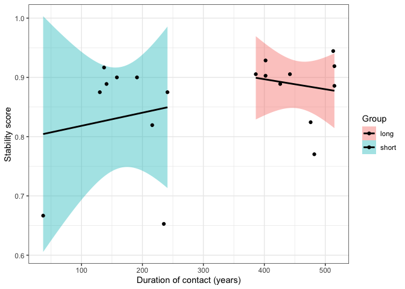<!-- -->

The variability in the two groups is very different. The direction of
the effect is interesting: shorter durations yield more stability more
consistently. Over time, the variability in mean stability increases.
Time is “destabillizing the pattern of stability”.

But it looks like you might have something tastier on your hands. The
creoles appear to be bouncing back toward the lexifier over time (based
on the duration findings; but perhaps I misunderstand).

And we can also increase the number of observations by running the
analysis at the segment level, rather than on mean stability.

Exploratory analysis with a generalized additive model (GAM).

``` r
# Factorize duration_group
creole_stability$duration_group <- as.factor(creole_stability$duration_group)

# Model with an interaction between duration_group and duration
# (with maximum of cubic-spline fit)
msd.gam <- gam(MeanStability ~ duration_group + s(duration, k = 3) + 
                 s(duration, by = duration_group, k = 3), data = creole_stability)

summary(msd.gam)
```

    ## 
    ## Family: gaussian 
    ## Link function: identity 
    ## 
    ## Formula:
    ## MeanStability ~ duration_group + s(duration, k = 3) + s(duration, 
    ##     by = duration_group, k = 3)
    ## 
    ## Parametric coefficients:
    ##                     Estimate Std. Error t value Pr(>|t|)  
    ## (Intercept)           2.1902     0.7763   2.821   0.0140 *
    ## duration_groupshort  -1.9481     0.8695  -2.241   0.0425 *
    ## ---
    ## Signif. codes:  0 '***' 0.001 '**' 0.01 '*' 0.05 '.' 0.1 ' ' 1
    ## 
    ## Approximate significance of smooth terms:
    ##                                    edf Ref.df     F p-value  
    ## s(duration)                     0.6667 0.6667 6.264  0.0618 .
    ## s(duration):duration_grouplong  1.4159 1.6038 1.375  0.1693  
    ## s(duration):duration_groupshort 1.4575 1.6229 2.237  0.1032  
    ## ---
    ## Signif. codes:  0 '***' 0.001 '**' 0.01 '*' 0.05 '.' 0.1 ' ' 1
    ## 
    ## Rank: 7/8
    ## R-sq.(adj) =  0.293   Deviance explained = 47.1%
    ## GCV = 0.0067504  Scale est. = 0.0047821  n = 19

``` r
plot(msd.gam, all.terms = T, shade = T, pages = 1)
```

<!-- -->

``` r
qqnorm(resid(msd.gam))
qqline(resid(msd.gam))
```

<!-- -->

``` r
msd.gam.trimmed <- gam(MeanStability ~ duration_group + s(duration, k = 3) 
                       + s(duration, by = duration_group, k = 3), 
                       data = creole_stability %>% filter(MeanStability > 0.7))

summary(msd.gam.trimmed)
```

    ## 
    ## Family: gaussian 
    ## Link function: identity 
    ## 
    ## Formula:
    ## MeanStability ~ duration_group + s(duration, k = 3) + s(duration, 
    ##     by = duration_group, k = 3)
    ## 
    ## Parametric coefficients:
    ##                     Estimate Std. Error t value Pr(>|t|)   
    ## (Intercept)           1.3221     0.3396   3.893  0.00202 **
    ## duration_groupshort  -0.5035     0.3470  -1.451  0.17162   
    ## ---
    ## Signif. codes:  0 '***' 0.001 '**' 0.01 '*' 0.05 '.' 0.1 ' ' 1
    ## 
    ## Approximate significance of smooth terms:
    ##                                    edf Ref.df     F p-value
    ## s(duration)                     0.6667 0.6667 2.975   0.184
    ## s(duration):duration_grouplong  1.2683 1.5080 1.101   0.374
    ## s(duration):duration_groupshort 0.6667 0.6667 1.379   0.357
    ## 
    ## Rank: 7/8
    ## R-sq.(adj) =  -0.0156   Deviance explained = 21.3%
    ## GCV = 0.0026593  Scale est. = 0.0019395  n = 17

``` r
plot(msd.gam.trimmed, sel = 1, shade = T, ylab = "Effect on mean stability", 
     xlab = "Duration of influence", residuals = T, main = "Main effect of duration", 
     cex = 5, pch = ".", col = "dodgerblue")
abline(h = 0, lty = 2, col = "red")
```

<!-- -->

``` r
plot(msd.gam.trimmed, sel = 2, shade = T, ylab = "Effect on mean stability", 
     xlab = "Duration of influence", main = "Long-term influence", col = "dodgerblue")
abline(h = 0, lty = 2, col = "red")
```

<!-- -->

``` r
plot(msd.gam.trimmed, sel = 3, shade = T, ylab = "Effect on mean stability", 
     xlab = "Duration of influence", main = "Short-term influence", col = "dodgerblue")
abline(h = 0, lty = 2, col = "red")
```

<!-- -->

``` r
# (dotted lines indicate error)
plot(msd.gam.trimmed, all.terms = T, sel = 4, ylab = "Effect on mean stability", 
     xlab = "Duration group", main = "Main effect of duration group")
```

<!-- -->

``` r
# checking out the model performance
qqnorm(resid(msd.gam.trimmed))
qqline(resid(msd.gam.trimmed)) # meh
```

<!-- -->

Removing the two creoles with the lowest scores produces significant
effects. This doesn’t seem very reliable though, especially given the
small sample size. Also, the pattern is strange: a negative trend of
duration for long-term influence and a positive one for short-term
influence? Note that the model detected a mean difference between
duration groups, with the short group having (slightly) lower mean
stability. This appears to be the case – but again – we have so few
observations.

## Duration effects on the segment level

Does duration affect the stability values of specific segments or
segment classes?

``` r
ggplot(database, aes(duration, MannerStability, colour = duration_group)) +
  geom_point() +
  geom_smooth(method = "lm") +
  facet_wrap(~Class) +
  xlab("Duration (years)") +
  ylab("Manner stability") +
  labs(color = "Duration")
```

<!-- -->

``` r
ggplot(database, aes(duration, GlobalStability, colour = duration_group)) +
  geom_point() +
  geom_smooth() +
  facet_wrap(~Class) +
  xlab("Duration (years)") +
  ylab("Global stability") +
  labs(color = "Duration")
```

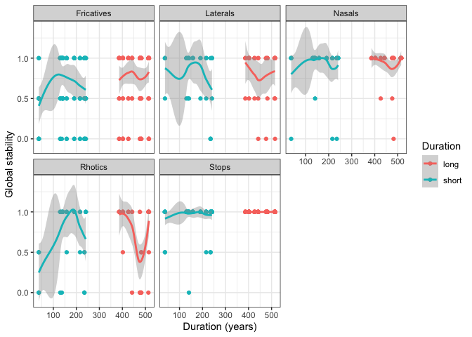<!-- -->

``` r
ggplot(database, aes(duration, PlaceStability, colour = duration_group)) +
  geom_point() +
  geom_smooth(method = "lm") +
  facet_wrap(~LexifierPhoneme) +
  xlab("Duration (years)") +
  ylab("Place stability") +
  labs(color = "Duration")
```

<!-- -->

``` r
ggplot(database, aes(duration, MannerStability, colour = duration_group)) +
  geom_point() +
  geom_smooth() +
  facet_wrap(~LexifierPhoneme) +
  xlab("Duration (years)") +
  ylab("Mean stability") +
  labs(color = "Duration")
```

<!-- -->

``` r
ggplot(database, aes(duration, GlobalStability, colour = duration_group)) +
  geom_point() +
  geom_smooth() +
  facet_wrap(~LexifierPhoneme) +
  xlab("Duration (years)") +
  ylab("Global stability") +
  labs(color = "Duration")
```

<!-- -->

## Jaccard distance between inventories

``` r
df_jac <- read_csv("Inventories.csv")
#df_jac <- df_jac %>% subset(Category != 'creole') 
df_jac <- df_jac %>% dplyr::select(c('Language','Phoneme'))
df_jac$presence <- 1
df_wide <- df_jac %>% spread(Phoneme, presence)
df_wide <- df_wide %>% replace(is.na(.), 0)
head(df_wide)
```

    ## # A tibble: 6 × 116
    ##   Language         b   `b̤`    bː    bʰ  `b̤ʱ`     c     ç    cç   cçʰ    cʰ     d
    ##   <chr>        <dbl> <dbl> <dbl> <dbl> <dbl> <dbl> <dbl> <dbl> <dbl> <dbl> <dbl>
    ## 1 Angolar          1     0     0     0     0     0     0     0     0     0     1
    ## 2 Cantonese        0     0     0     0     0     0     0     0     0     0     0
    ## 3 Cape Verdea…     1     0     0     0     0     0     0     0     0     0     1
    ## 4 Cape Verdea…     1     0     0     0     0     0     0     0     0     0     1
    ## 5 Cape Verdea…     1     0     0     0     0     0     0     0     0     0     1
    ## 6 Cape Verdea…     1     0     0     0     0     0     0     0     0     0     1
    ## # ℹ 104 more variables: `d̪` <dbl>, ð <dbl>, `d̪̤` <dbl>, dʰ <dbl>, `d̪̤ʱ` <dbl>,
    ## #   dz <dbl>, `d̤z` <dbl>, `d̠ʒ` <dbl>, `d̤ʒ̤ʱ` <dbl>, ɖ <dbl>, `ɖ̤` <dbl>,
    ## #   ɖʰ <dbl>, `ɖ̤ʱ` <dbl>, f <dbl>, g <dbl>, ɣ <dbl>, ɡ <dbl>, ɡb <dbl>,
    ## #   gʰ <dbl>, ɡʰ <dbl>, ɡʱ <dbl>, `ɡ̤ʱ` <dbl>, h <dbl>, ɦ <dbl>, j <dbl>,
    ## #   ɟ <dbl>, ɟː <dbl>, ɟʰ <dbl>, ɟʝ <dbl>, `ɟ̤ʝ` <dbl>, k <dbl>, kʰ <dbl>,
    ## #   kp <dbl>, kʷ <dbl>, kʷʰ <dbl>, l <dbl>, `l̤` <dbl>, ɭ <dbl>, lː <dbl>,
    ## #   m <dbl>, `m̤` <dbl>, mː <dbl>, mb <dbl>, ɱf <dbl>, mpʰ <dbl>, ɱv <dbl>, …

``` r
tmp <- df_wide %>%
  column_to_rownames(var = "Language")
jac_dist <- jaccard(t(tmp))
```

The Jaccard distance values were then manually extracted into a new
table, so we could visualize those values according to the relevant
language in contact (jaccard_results.csv). Then, we created a new table
which summaries those results for creoles and joins their stability
values, so we can assess if there is or there is not a correlation
between the jaccard distances and the overall stability os creoles.

``` r
df_cor <- read.csv("jaccard_summary.csv")
```

Linear models

Inventory distance creoles ~ Portuguese

``` r
cl <- lm(stability ~ lex_crio, data=df_cor)
summary(cl)
```

    ## 
    ## Call:
    ## lm(formula = stability ~ lex_crio, data = df_cor)
    ## 
    ## Residuals:
    ##       Min        1Q    Median        3Q       Max 
    ## -0.210456  0.004963  0.036732  0.043100  0.058147 
    ## 
    ## Coefficients:
    ##             Estimate Std. Error t value Pr(>|t|)    
    ## (Intercept)   0.9335     0.0532  17.546 2.51e-12 ***
    ## lex_crio     -0.2109     0.1463  -1.441    0.168    
    ## ---
    ## Signif. codes:  0 '***' 0.001 '**' 0.01 '*' 0.05 '.' 0.1 ' ' 1
    ## 
    ## Residual standard error: 0.07987 on 17 degrees of freedom
    ## Multiple R-squared:  0.1089, Adjusted R-squared:  0.05647 
    ## F-statistic: 2.077 on 1 and 17 DF,  p-value: 0.1677

``` r
ggplot(df_cor, aes(x = stability, y = lex_crio, label = Language)) +
  geom_smooth(method = "lm") +
  geom_point() +
geom_text(aes(label=Language), hjust=1, vjust=0)
```

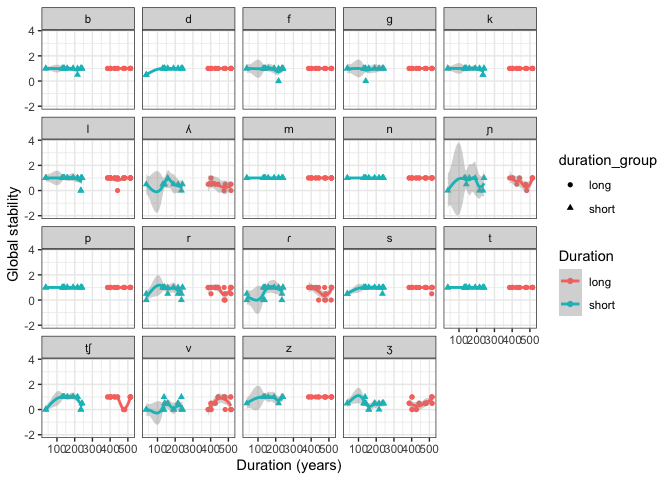<!-- -->

Inventory distance substrates ~ Portuguese

``` r
sl_mean <- lm(stability ~ lex_subs_mean, data=df_cor)
summary(sl_mean)
```

    ## 
    ## Call:
    ## lm(formula = stability ~ lex_subs_mean, data = df_cor)
    ## 
    ## Residuals:
    ##       Min        1Q    Median        3Q       Max 
    ## -0.191196 -0.009182  0.021829  0.050399  0.091351 
    ## 
    ## Coefficients:
    ##               Estimate Std. Error t value Pr(>|t|)    
    ## (Intercept)     0.7064     0.1450   4.871 0.000144 ***
    ## lex_subs_mean   0.2416     0.2240   1.079 0.295663    
    ## ---
    ## Signif. codes:  0 '***' 0.001 '**' 0.01 '*' 0.05 '.' 0.1 ' ' 1
    ## 
    ## Residual standard error: 0.08185 on 17 degrees of freedom
    ## Multiple R-squared:  0.06409,    Adjusted R-squared:  0.009041 
    ## F-statistic: 1.164 on 1 and 17 DF,  p-value: 0.2957

``` r
ggplot(df_cor, aes(x = stability, y = lex_subs_mean, label = Language)) +
  geom_smooth(method = "lm") +
  geom_point() +
  geom_text(aes(label=Language), hjust=1, vjust=0)
```

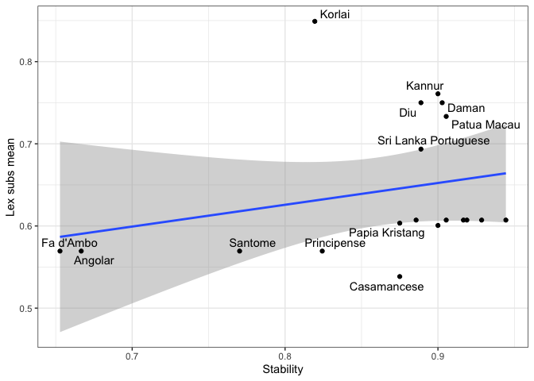<!-- -->

Inventory distance substrates ~ creoles

``` r
sc_mean <- lm(stability ~ crio_subs_mean, data=df_cor)
summary(sc_mean)
```

    ## 
    ## Call:
    ## lm(formula = stability ~ crio_subs_mean, data = df_cor)
    ## 
    ## Residuals:
    ##      Min       1Q   Median       3Q      Max 
    ## -0.20840 -0.02278  0.03155  0.04882  0.08357 
    ## 
    ## Coefficients:
    ##                Estimate Std. Error t value Pr(>|t|)    
    ## (Intercept)     0.89192    0.07841   11.38 2.27e-09 ***
    ## crio_subs_mean -0.05658    0.14151   -0.40    0.694    
    ## ---
    ## Signif. codes:  0 '***' 0.001 '**' 0.01 '*' 0.05 '.' 0.1 ' ' 1
    ## 
    ## Residual standard error: 0.08421 on 17 degrees of freedom
    ## Multiple R-squared:  0.009317,   Adjusted R-squared:  -0.04896 
    ## F-statistic: 0.1599 on 1 and 17 DF,  p-value: 0.6942

``` r
ggplot(df_cor, aes(x = stability, y = crio_subs_mean, label = Language)) +
  geom_smooth(method = "lm") +
  geom_point() +
  geom_text(aes(label=Language), hjust=1, vjust=0)
```

<!-- -->

# Consonant stability

Which segments are the most stable across creoles in the language
sample?

We calculate stability of place and manner for each phoneme.

``` r
place_results <- database %>%
  group_by(LexifierPhoneme) %>%
  summarize(mplace = mean(PlaceStability, na.rm = TRUE))
manner_results <- database %>%
  group_by(LexifierPhoneme) %>%
  summarize(mmanner = mean(MannerStability, na.rm = TRUE))

consonant_stability <- left_join(place_results, manner_results, by = "LexifierPhoneme")

class <- c("stop", "stop", "fricative", "stop", "stop", "lateral","nasal", "nasal", "stop", "rhotic","fricative", "stop","affricate", "fricative", "fricative","nasal", "rhotic", "lateral", "fricative")

consonant_stability_class <- cbind(consonant_stability, class)
```

Next, we plot the results.

``` r
ggplot(consonant_stability, aes(y = mmanner, x = mplace)) +
  geom_point(position = "dodge", aes(color = class)) +
  geom_text_repel(aes(label = LexifierPhoneme), size = 4) +
  xlab("Mean stability (place of articulation)") +
  ylab("Mean stability (manner of articulation)") +
  labs(color = "Segment class")
```

<!-- -->

A linear model to assess the relationship between manner and place
stability

``` r
lm_manner_place <- lm(mplace~mmanner, data=consonant_stability)

summary(lm_manner_place)
```

    ## 
    ## Call:
    ## lm(formula = mplace ~ mmanner, data = consonant_stability)
    ## 
    ## Residuals:
    ##       Min        1Q    Median        3Q       Max 
    ## -0.206903 -0.000738  0.013372  0.037250  0.126426 
    ## 
    ## Coefficients:
    ##             Estimate Std. Error t value Pr(>|t|)    
    ## (Intercept)  0.28293    0.06764   4.183 0.000624 ***
    ## mmanner      0.70370    0.07873   8.938 7.81e-08 ***
    ## ---
    ## Signif. codes:  0 '***' 0.001 '**' 0.01 '*' 0.05 '.' 0.1 ' ' 1
    ## 
    ## Residual standard error: 0.07783 on 17 degrees of freedom
    ## Multiple R-squared:  0.8246, Adjusted R-squared:  0.8142 
    ## F-statistic:  79.9 on 1 and 17 DF,  p-value: 7.811e-08

``` r
manner_place_lmplot <- ggplot(consonant_stability, aes(y = mmanner, x = mplace, label = LexifierPhoneme)) +
  geom_point(position= "dodge") + 
  geom_smooth(method = lm)+
  geom_text(aes(label=LexifierPhoneme), hjust=3, vjust=0)

print(manner_place_lmplot + labs(y = "Manner Stability", x = "Place Stability"))
```

<!-- -->

Here is an alternative view for the global results.

``` r
consonant_global_stability <- mutate(consonant_stability_class, 
                                     mglobal = (mmanner + mplace) / 2)

write.csv(consonant_global_stability, "consonant_global_stability.csv", row.names=FALSE)

ggplot(consonant_global_stability) +
  geom_bar(aes(
    x = mglobal,
    y = reorder(LexifierPhoneme, mglobal),
    fill = class
  ), stat = "identity", show.legend = TRUE) +
  labs(x = "Stability score", y = "Phoneme", fill = "Manner")
```

<!-- -->

## Manner stability

Check for class effects on the global stability of consonants

``` r
ggplot(consonant_global_stability, aes(x = class, y = mglobal, fill = class)) +
  geom_smooth(method = "lm") +
  geom_violin() +
   geom_dotplot(binaxis = "y",
               stackdir = "center",
               dotsize = 0.5)
```

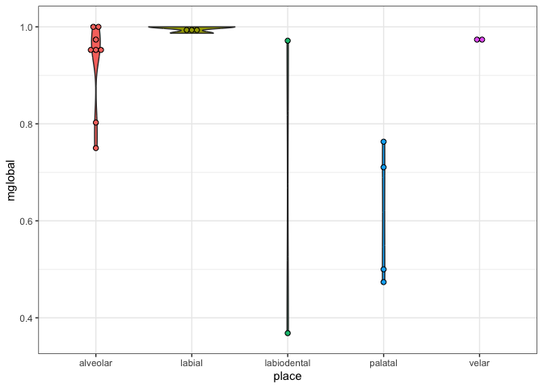<!-- -->

Now, just plotting the relation manner to manner

``` r
ggplot(consonant_global_stability, aes(x = class, y = mmanner, fill = class)) +
  geom_smooth(method = "lm") +
  geom_violin() +
   geom_dotplot(binaxis = "y",
               stackdir = "center",
               dotsize = 0.5) +
  theme(legend.position="none") +
 stat_summary(fun.y=mean, geom="point", size=2, shape=16)
```

<!-- -->

## Place stability

Check place effects on the global stability of the consonants

``` r
place <- c("labial", "alveolar", "labiodental", "velar", "velar", "alveolar", "labial", "alveolar", "labial", "alveolar", "alveolar", "alveolar", "palatal", "labiodental", "alveolar", "palatal", "alveolar", "palatal", "palatal")

consonant_stability_place <- cbind(consonant_global_stability, place)

ggplot(consonant_stability_place, aes(x = place, y = mglobal, fill = place)) +
  geom_smooth(method = "lm") +
  geom_violin() +
   geom_dotplot(binaxis = "y",
               stackdir = "center",
               dotsize = 0.5) +
  theme(legend.position="none")
```

<!-- --> Now, just
with the mean for Place stability

``` r
ggplot(consonant_stability_place, aes(x = place, y = mplace, fill = place)) +
  geom_smooth(method = "lm") +
  geom_violin()  +
   geom_dotplot(binaxis = "y",
               stackdir = "center",
               dotsize = 0.5)  +
  theme(legend.position="none") +
  ylab("Place stability score") +
  xlab("Place of articulation") +
 stat_summary(fun.y=mean, geom="point", size=2, shape=16)
```

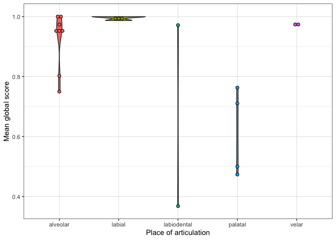<!-- -->

Calculate the stability of the segments.

``` r
# qplot(x = duration, y = MeanStability, data = consonant_global_stability, color = duration_group) +
#  geom_smooth(method = "lm") 
```

And we can also increase the number of observations in duration
regression by running the analysis at the segment level, rather than on
mean stability.

``` r
# Factorizing
mod.db <- database %>%
  as.data.frame() %>%
  mutate(
    categorical_stability = as.factor(categorical_stability),
    Lexifier = as.factor(Lexifier),
    CreolePhoneme = as.factor(CreolePhoneme),
    Language = as.factor(Language)
  )

# Remove singletons/doubletons
# goodies = names(table(mod.db$CreolePhoneme)>2)

# mod.db = mod.db %>%
#         filter(CreolePhoneme %in% goodies)
```

``` r
plot(mod.db$categorical_stability, mod.db$duration, notch = T)
```

<!-- -->

Hugely skewed in favor of no manner/place (10x as frequent as the next
most frequent level; this could cause problems for the models).

``` r
table(mod.db$categorical_stability)
```

    ## 
    ##    manner/no place       manner/place no manner/no place    no manner/place 
    ##                 49                 58                553                 25

``` r
# Place stability
cat.mod.place <- glmer(PlaceStability ~ log(duration) + (1 | CreolePhoneme), 
                       data = mod.db, family = "binomial")

summary(cat.mod.place)
```

    ## Generalized linear mixed model fit by maximum likelihood (Laplace
    ##   Approximation) [glmerMod]
    ##  Family: binomial  ( logit )
    ## Formula: PlaceStability ~ log(duration) + (1 | CreolePhoneme)
    ##    Data: mod.db
    ## 
    ##      AIC      BIC   logLik deviance df.resid 
    ##    305.4    319.0   -149.7    299.4      682 
    ## 
    ## Scaled residuals: 
    ##     Min      1Q  Median      3Q     Max 
    ## -6.3810  0.0327  0.0341  0.1593  2.3669 
    ## 
    ## Random effects:
    ##  Groups        Name        Variance Std.Dev.
    ##  CreolePhoneme (Intercept) 34.8     5.899   
    ## Number of obs: 685, groups:  CreolePhoneme, 34
    ## 
    ## Fixed effects:
    ##               Estimate Std. Error z value Pr(>|z|)  
    ## (Intercept)     5.5541     3.0094   1.846   0.0649 .
    ## log(duration)  -0.0260     0.2695  -0.096   0.9231  
    ## ---
    ## Signif. codes:  0 '***' 0.001 '**' 0.01 '*' 0.05 '.' 0.1 ' ' 1
    ## 
    ## Correlation of Fixed Effects:
    ##             (Intr)
    ## log(duratn) -0.560

``` r
# Manner stability
cat.mod.manner <- glmer(MannerStability ~ log(duration) + (1 | CreolePhoneme), 
                        data = mod.db, family = "binomial")

summary(cat.mod.manner)
```

    ## Generalized linear mixed model fit by maximum likelihood (Laplace
    ##   Approximation) [glmerMod]
    ##  Family: binomial  ( logit )
    ## Formula: MannerStability ~ log(duration) + (1 | CreolePhoneme)
    ##    Data: mod.db
    ## 
    ##      AIC      BIC   logLik deviance df.resid 
    ##    258.1    271.7   -126.0    252.1      682 
    ## 
    ## Scaled residuals: 
    ##     Min      1Q  Median      3Q     Max 
    ## -6.8056  0.0038  0.0044  0.1764  1.0106 
    ## 
    ## Random effects:
    ##  Groups        Name        Variance Std.Dev.
    ##  CreolePhoneme (Intercept) 406.8    20.17   
    ## Number of obs: 685, groups:  CreolePhoneme, 34
    ## 
    ## Fixed effects:
    ##               Estimate Std. Error z value Pr(>|z|)    
    ## (Intercept)     8.6821     2.5407   3.417 0.000633 ***
    ## log(duration)   0.3547     0.2668   1.329 0.183708    
    ## ---
    ## Signif. codes:  0 '***' 0.001 '**' 0.01 '*' 0.05 '.' 0.1 ' ' 1
    ## 
    ## Correlation of Fixed Effects:
    ##             (Intr)
    ## log(duratn) -0.576

``` r
# Duration group
cat.mod.group <- glmer(as.factor(duration_group) ~ PlaceStability + 
                         MannerStability + (1 | CreolePhoneme), 
                       data = mod.db, family = "binomial", nAGQ = 0)
```

    ## boundary (singular) fit: see help('isSingular')

``` r
summary(cat.mod.group)
```

    ## Generalized linear mixed model fit by maximum likelihood (Adaptive
    ##   Gauss-Hermite Quadrature, nAGQ = 0) [glmerMod]
    ##  Family: binomial  ( logit )
    ## Formula: as.factor(duration_group) ~ PlaceStability + MannerStability +  
    ##     (1 | CreolePhoneme)
    ##    Data: mod.db
    ## 
    ##      AIC      BIC   logLik deviance df.resid 
    ##    934.3    952.4   -463.2    926.3      681 
    ## 
    ## Scaled residuals: 
    ##     Min      1Q  Median      3Q     Max 
    ## -1.0869 -0.8359 -0.8359  1.1963  1.5223 
    ## 
    ## Random effects:
    ##  Groups        Name        Variance Std.Dev.
    ##  CreolePhoneme (Intercept) 0        0       
    ## Number of obs: 685, groups:  CreolePhoneme, 34
    ## 
    ## Fixed effects:
    ##                 Estimate Std. Error z value Pr(>|z|)  
    ## (Intercept)      -0.3154     0.2375  -1.328   0.1843  
    ## PlaceStability    0.4820     0.2935   1.642   0.1006  
    ## MannerStability  -0.5251     0.2583  -2.033   0.0421 *
    ## ---
    ## Signif. codes:  0 '***' 0.001 '**' 0.01 '*' 0.05 '.' 0.1 ' ' 1
    ## 
    ## Correlation of Fixed Effects:
    ##             (Intr) PlcStb
    ## PlaceStblty -0.571       
    ## MannrStblty -0.295 -0.568
    ## optimizer (bobyqa) convergence code: 0 (OK)
    ## boundary (singular) fit: see help('isSingular')

Some indication that place stability is more often associated with
shorter periods of influence.

Numerically, the manner/place category has 50% of its observations in
the longest duration from the sample. At the same time, no manner/no
place is associated with the shortest duration.

## Word position

Next we ask, does word position influence stability?

First, data preparation.

``` r
data_by_position <- database %>%
  dplyr::select(Position, LexifierPhoneme, PlaceStability, MannerStability) %>%
  mutate(Position = tolower(Position))

data_by_position$PlaceStability <- as.numeric(data_by_position$PlaceStability)

data_by_position$MannerStability <- as.numeric(data_by_position$MannerStability)
```

Next, calculate stability for each segment according to its word
position.

``` r
position_stability <- mutate(data_by_position, GlobalStability = 
                               (PlaceStability + MannerStability) / 2)

position_results <- position_stability %>%
  group_by(LexifierPhoneme, Position) %>%
  summarize(m = mean(GlobalStability, na.rm = TRUE))
```

And plot the results for all segments.

``` r
position_results$Position <- factor(position_results$Position, 
                                    levels = c("word-initial", 
                                               "word-medial", 
                                               "word-final"))

ggplot(position_results, aes(x = LexifierPhoneme, y = m, fill = Position)) +
  geom_col(position = position_dodge2(width = 0.9, preserve = "single")) +
  theme(
    axis.title.x = element_blank(),
    axis.title.y = element_blank()
  ) +
  labs(x = "Lexifier phoneme", y = "Mean stability", fill = "Word position")
```

<!-- -->

Flip horizontally.

``` r
ggplot(position_results) +
  geom_bar(
    aes(
      x = m,
      y = reorder(LexifierPhoneme, m),
      fill = Position
    ),
    stat = "identity",
    show.legend = TRUE,
    position = "dodge2"
  ) +
  labs(x = "Stability score", y = "Phoneme", fill = "Word position")
```

<!-- -->

Plot the results for segments that show differences.

``` r
position_results1 <- position_results %>% 
  pivot_wider(names_from = Position, values_from = m)

different_position <- subset(position_results1, position_results1$`word-initial` 
                             != position_results1$`word-medial` | 
                               position_results1$`word-final` 
                             != position_results1$`word-medial`)

different_position_results <- different_position %>% 
  pivot_longer(c(`word-initial`, `word-medial`, `word-final`), 
               names_to = "Position", values_to = "m")

different_position_results$Position <- factor(different_position_results$Position, 
                                              levels = c("word-initial", 
                                                         "word-medial", 
                                                         "word-final"))

ggplot(
  different_position_results,
  aes(x = LexifierPhoneme, y = m, fill = Position)
) +
  geom_col(position = position_dodge2(width = 0.9, preserve = "single")) +
  labs(x = "Lexifier phoneme", y = "Mean stability", fill = "Word position")
```

<!-- -->

Flip horizontally.

``` r
ggplot(different_position_results) +
  geom_bar(
    aes(
      x = m,
      y = reorder(LexifierPhoneme, m),
      fill = Position
    ),
    stat = "identity",
    show.legend = TRUE,
    position = "dodge2"
  ) +
  labs(x = "Stability score", y = "Phoneme", fill = "Word position")
```

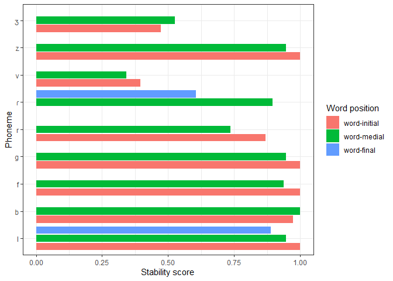<!-- -->

## Typological frequency and borrowability

First, we turn the data into ordinal.

Ordinal data was generated by ranking the percentage values of
stability, borrowability and typological frequency from 1 to 19.
Duplicate values summed and averaged in the ranking.

1)  Cross linguistic frequency

``` r
order_typ <- c(1,
2   ,
3   ,
4   ,
5   ,
5   ,
7   ,
8   ,
9   ,
10  ,
11.5    ,
11.5    ,
13  ,
14  ,
15  ,
16  ,
17  ,
18  ,
19)
consonant <- c("m",
             "k",
             "p",
             "n",
             "t",
             "l",
             "s",
             "b",
             "g",
             "d",
             "f",
             "r",
             "ɲ",
             "t̠ʃ",
             "z",
             "v",
             "ɾ",
             "ʒ",
             "ʎ")
df_typ <- data.frame(order_typ, consonant)
```

2)  Borrowability

``` r
order_bor <- c(1    ,
2   ,
3   ,
4   ,
5   ,
6   ,
6   ,
8   ,
9   ,
10  ,
11  ,
12  ,
13  ,
14.5    ,
14.5    ,
16  ,
17  ,
18  ,
19)
consonant <- c("f",
              "g",
              "t̠ʃ",
              "b",
              "z",
              "v",
              "d",
              "r",
              "p",
              "l",
              "s",
              "ʒ",
              "ɾ",
              "ɲ",
              "k",
              "ʎ",
              "t",
              "n",
              "m")
df_bor <- data.frame(order_bor, consonant)
```

3)  Stability values

``` r
order_sta <- c(2,
2   ,
2   ,
2   ,
5   ,
7 ,
7   ,
7   ,
8   ,
10  ,
11  ,
12  ,
13  ,
14  ,
15  ,
16  ,
17  ,
18  ,
19)
consonant <- c("t",
               "p",
               "n",
               "m",
               "f",
               "b",
               "k",
               "g",
               "d",
               "z",
               "s",
               "l",
               "r",
               "t̠ʃ",
               "ɾ",
               "ɲ",
               "ʒ",
               "ʎ",
               "v")
df_sta <- data.frame(order_sta, consonant)
```

Then, we create the data frames and prepare them for non-parametric
tests

Long format with joint groups

``` r
df_friedman <- left_join(df_sta, df_bor, by="consonant")

order_df <- left_join(df_friedman, df_typ, by="consonant")
head(order_df)
```

    ##   order_sta consonant order_bor order_typ
    ## 1         2         t        17       5.0
    ## 2         2         p         9       3.0
    ## 3         2         n        18       4.0
    ## 4         2         m        19       1.0
    ## 5         5         f         1      11.5
    ## 6         7         b         4       8.0

``` r
df_long <- order_df %>% gather(key = "conditions", 
                         value = "order", order_bor, order_sta, order_typ)

head(df_long)
```

    ##   consonant conditions order
    ## 1         t  order_bor    17
    ## 2         p  order_bor     9
    ## 3         n  order_bor    18
    ## 4         m  order_bor    19
    ## 5         f  order_bor     1
    ## 6         b  order_bor     4

In particular, for the Spearman’s rank correlation coefficient

Large format and separated groups

``` r
df_sta_bor <- left_join(df_sta, df_bor, by="consonant")
df_sta_typ <- left_join(df_sta, df_typ, by="consonant")
```

Converting to long format

``` r
sta_bor_long <- df_sta_bor %>% gather(key = "conditions", 
                                    value = "order", order_bor, order_sta)
sta_typ_long <- df_sta_typ %>% gather(key = "conditions", 
                                      value = "order", order_typ, order_sta)
```

Finally, we perform the non-parametric tests

Statistical summary

``` r
df_long %>% group_by(conditions) %>%  summarise(n = n(), mean = mean(order), 
                                               sd = sd(order))
```

    ## # A tibble: 3 × 4
    ##   conditions     n  mean    sd
    ##   <chr>      <int> <dbl> <dbl>
    ## 1 order_bor     19  9.95  5.66
    ## 2 order_sta     19  9.84  5.76
    ## 3 order_typ     19  9.95  5.67

A first plot

``` r
ggplot(df_long, aes(x = consonant, y = order)) + geom_boxplot(outlier.shape = NA) + 
  geom_jitter(width = 0.2) + theme(legend.position="top")
```

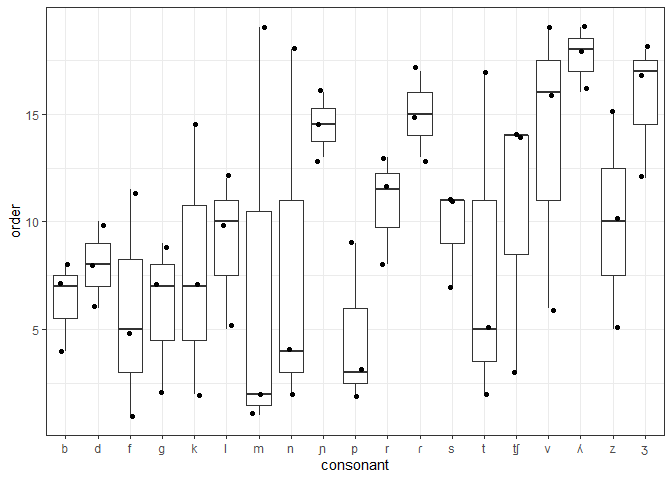<!-- -->

1)  Friedman test

``` r
friedman.test(y = df_long$order, groups = df_long$conditions, blocks = df_long$consonant)
```

    ## 
    ##  Friedman rank sum test
    ## 
    ## data:  df_long$order, df_long$conditions and df_long$consonant
    ## Friedman chi-squared = 2.5135, df = 2, p-value = 0.2846

``` r
df_long %>% friedman_effsize(order ~ conditions | consonant)
```

    ## # A tibble: 1 × 5
    ##   .y.       n effsize method    magnitude
    ## * <chr> <int>   <dbl> <chr>     <ord>    
    ## 1 order    19  0.0661 Kendall W small

2)  Conover’s all-pairs test

``` r
frdAllPairsConoverTest(
  y = df_long$order, 
  groups = df_long$conditions, 
  blocks = df_long$consonant, 
  p.adjust.method = "bonf")
```

    ##           order_bor order_sta
    ## order_sta 0.68      -        
    ## order_typ 0.44      1.00

3)  Durbin’s all-pairs test

``` r
durbinAllPairsTest(
  y      = df_long$order, 
  groups = df_long$conditions, 
  blocks = df_long$consonant,
  p.adjust.method = "holm")
```

    ##           order_bor order_sta
    ## order_sta 0.44      -        
    ## order_typ 0.43      0.81

4)  Spearman’s Correlation Coefficient

4.1) Stability~Borrowability

``` r
cor.test(x=df_sta_bor$order_bor, 
         y=df_sta_bor$order_sta, 
         method = 'spearman')
```

    ## 
    ##  Spearman's rank correlation rho
    ## 
    ## data:  df_sta_bor$order_bor and df_sta_bor$order_sta
    ## S = 1252.8, p-value = 0.687
    ## alternative hypothesis: true rho is not equal to 0
    ## sample estimates:
    ##         rho 
    ## -0.09894132

4.2) Stability~Typological frequency

``` r
cor.test(x=df_sta_typ$order_typ, 
         y=df_sta_typ$order_sta, 
         method = 'spearman')
```

    ## 
    ##  Spearman's rank correlation rho
    ## 
    ## data:  df_sta_typ$order_typ and df_sta_typ$order_sta
    ## S = 197.88, p-value = 1.295e-05
    ## alternative hypothesis: true rho is not equal to 0
    ## sample estimates:
    ##      rho 
    ## 0.826425

Visualizing the results

Box plots

Stability vs typological frequency

``` r
ggplot(sta_typ_long, aes(x = consonant, y = order)) + geom_boxplot(outlier.shape = NA) + 
  geom_jitter(width = 0.2) + theme(legend.position="top")
```

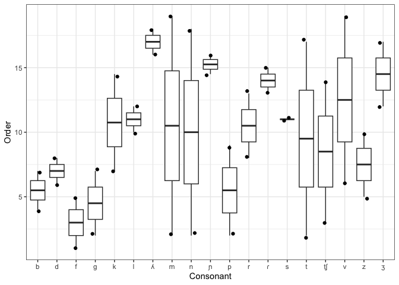<!-- -->

Stability vs borrowability

``` r
ggplot(sta_bor_long, aes(x = consonant, y = order)) + geom_boxplot(outlier.shape = NA) + 
  geom_jitter(width = 0.2) + theme(legend.position="top")
```

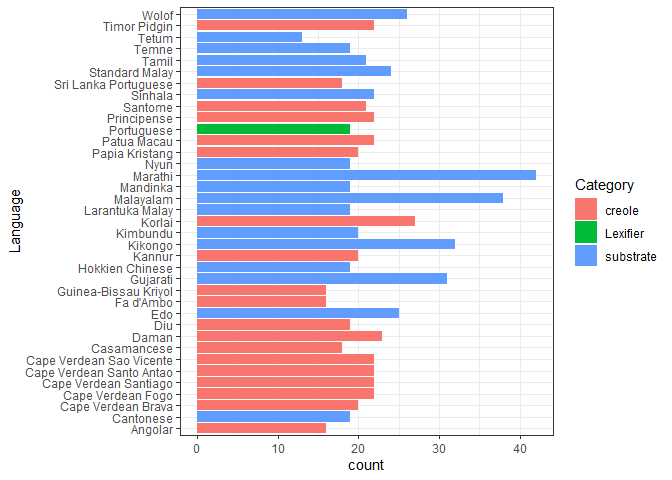<!-- -->

Bump chart

``` r
ggplot(data = df_long, aes(x = conditions, y = order, group = consonant)) +
  geom_line(aes(color = consonant, alpha = 1), size = 1) +
  geom_point(aes(color = consonant, alpha = 1), size = 2,  alpha = 0.8) +
  scale_y_reverse(breaks = 1:nrow(df_long)) +
  scale_alpha(guide = 'none') +
  #theme(legend.position="bottom") +
  theme( panel.grid.major = element_blank(), 
        panel.grid.minor = element_blank())
```

<!-- -->

``` r
    #theme(panel.background = element_rect(color="white")) +
    #theme(plot.background  = element_rect(color="white")) +
    #theme(panel.border     = element_rect(color="white")) +
    #theme(strip.background = element_rect(color="white"))
```

## Inventory size and frequency across substrates

Get data

``` r
inv <- read.csv("Inventories.csv")
head(inv)
```

    ##   ID   Language Category Phoneme Notes              Source PhoibleID
    ## 1 19 Portuguese Lexifier       p       Castro2013[242-248]        NA
    ## 2 19 Portuguese Lexifier       b       Castro2013[242-248]        NA
    ## 3 19 Portuguese Lexifier       t       Castro2013[242-248]        NA
    ## 4 19 Portuguese Lexifier       d       Castro2013[242-248]        NA
    ## 5 19 Portuguese Lexifier       k       Castro2013[242-248]        NA
    ## 6 19 Portuguese Lexifier       g       Castro2013[242-248]        NA

Prepare data

``` r
df_inv_long <- inv %>% dplyr::select(Language, Phoneme) %>%  mutate(newcol = 1)

df_inv <- df_inv_long %>% pivot_wider(names_from = Language, values_from = newcol, values_fill = 0)

df_total_inv <- df_inv %>% mutate_at(c(2:38), as.numeric)

head(df_total_inv)
```

    ## # A tibble: 6 × 38
    ##   Phoneme Portuguese `Timor Pidgin` `Papia Kristang` `Patua Macau` Tetum
    ##   <chr>        <dbl>          <dbl>            <dbl>         <dbl> <dbl>
    ## 1 p                1              1                1             1     0
    ## 2 b                1              1                1             1     1
    ## 3 t                1              1                0             1     1
    ## 4 d                1              1                1             1     1
    ## 5 k                1              1                1             1     1
    ## 6 g                1              1                1             1     0
    ## # ℹ 32 more variables: `Larantuka Malay` <dbl>, `Standard Malay` <dbl>,
    ## #   `Hokkien Chinese` <dbl>, Cantonese <dbl>, Malayalam <dbl>,
    ## #   `Sri Lanka Portuguese` <dbl>, Diu <dbl>, Daman <dbl>, Korlai <dbl>,
    ## #   Kannur <dbl>, Sinhala <dbl>, Tamil <dbl>, Gujarati <dbl>, Marathi <dbl>,
    ## #   Santome <dbl>, Principense <dbl>, Angolar <dbl>, `Fa d'Ambo` <dbl>,
    ## #   `Cape Verdean Brava` <dbl>, `Cape Verdean Sao Vicente` <dbl>,
    ## #   `Cape Verdean Santo Antao` <dbl>, `Cape Verdean Fogo` <dbl>, …

Measuring the inventory size

Get the consonant inventory size for all languages

``` r
cons_count <- df_total_inv %>% dplyr::select(c(2:38)) %>% mutate_at(c(1:37), as.numeric)
  
count <- colSums(cons_count [,c(1:37)]) #%>% unname(colSums(count))

cons_lg <- dplyr::select(df_inv_long, "Language") 

Language <- unique(cons_lg$Language)

category <- inv %>% dplyr::select(Language, Category)

count_lg <- data.frame(cbind(Language, count)) 
  
count_lg_1 <- inner_join(count_lg, category, by = "Language") %>% distinct()

inv_size <- transform(count_lg_1, count = as.numeric(count))

head(inv_size)
```

    ##          Language count  Category
    ## 1      Portuguese    19  Lexifier
    ## 2    Timor Pidgin    22    creole
    ## 3  Papia Kristang    20    creole
    ## 4     Patua Macau    22    creole
    ## 5           Tetum    13 substrate
    ## 6 Larantuka Malay    19 substrate

Which languages have bigger inventories?

``` r
ggplot(inv_size) + 
  geom_bar(aes(x = Language,
               y = count,
              fill = Category), 
           stat = "identity", 
           show.legend = TRUE,
           position = "dodge2") + coord_flip()
```

<!-- -->

Violin plot: the majority of creoles have larger consonant inventories
than Portuguese.

``` r
ggplot(inv_size, aes(x = Category, y = count, fill = Category)) +
  geom_violin(alpha = 0.5) +
  geom_dotplot(binaxis = "y",
               stackdir = "center",
               dotsize = 0.5) +
  theme(legend.position = "none")
```

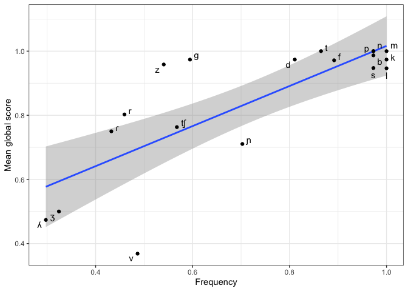<!-- -->

Consonant frequency in all languages involved

Count frequent consonants

``` r
total <- rowSums(cons_count)

cons_freq <- data.frame(cbind(df_total_inv$Phoneme, total))

cons_freq <- transform(cons_freq, total = as.numeric(total))

colnames(cons_freq)[1] <- "LexifierPhoneme"
```

Is there a relationship between this frequency and the stability values?

Subset: Portuguese consonants only

``` r
cons_freq_pt <- cons_freq %>% subset(LexifierPhoneme %in% c('b','d','f','g','k','l','ʎ','m','n','ɲ','p','t̠ʃ','ɾ','s',
                                       't','v','z','ʒ', 'r'))
```

First dataset: relative frequency values

``` r
cons_freq_rel <- cons_freq_pt %>% mutate(frequency = total/37)
```

Second dataset:stability values

``` r
consonant_global_stability <- read.csv("consonant_global_stability.csv")
```

Merge datasets

``` r
cor_freq_sta <- left_join(consonant_global_stability, cons_freq_rel, by='LexifierPhoneme')
```

Results of a simple regression

``` r
fs <- lm(frequency ~ mglobal, data=cor_freq_sta)
summary(fs)
```

    ## 
    ## Call:
    ## lm(formula = frequency ~ mglobal, data = cor_freq_sta)
    ## 
    ## Residuals:
    ##      Min       1Q   Median       3Q      Max 
    ## -0.29863 -0.07151  0.03980  0.11383  0.22911 
    ## 
    ## Coefficients:
    ##             Estimate Std. Error t value Pr(>|t|)    
    ## (Intercept)  -0.1060     0.1642  -0.645    0.527    
    ## mglobal       0.9862     0.1887   5.226 6.85e-05 ***
    ## ---
    ## Signif. codes:  0 '***' 0.001 '**' 0.01 '*' 0.05 '.' 0.1 ' ' 1
    ## 
    ## Residual standard error: 0.1618 on 17 degrees of freedom
    ## Multiple R-squared:  0.6163, Adjusted R-squared:  0.5938 
    ## F-statistic: 27.31 on 1 and 17 DF,  p-value: 6.851e-05

Plot the results

``` r
fs_plot <- ggplot(cor_freq_sta, aes(x = frequency, y = mglobal, label = LexifierPhoneme)) +
  geom_smooth(method = "lm") +
  geom_point() # +
  #geom_text(aes(label=V1), hjust=3, vjust=0)

fs_plot + geom_text_repel(aes(label=LexifierPhoneme))
```

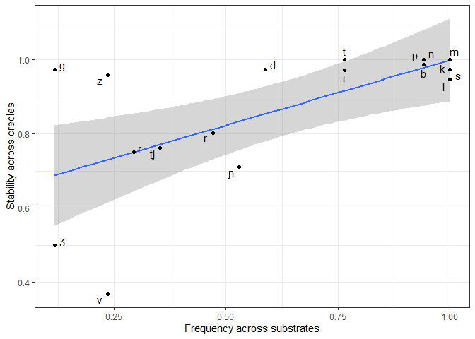<!-- -->

There relationship between stability and frequency across all languages
involved. But does it make sense? We are measuring the consonants in all
categories and the present of the lexifier and the creoles may influence
the results. Perhaps, we should try to subset and measure the frequency
across substrates only, but I think that this procedure would just
increase the lack of correlation.

Is there a relationship between consonant stability and their presence
in the inventories of the substrate languages?

Data preparation (substrates only)

``` r
inv_subs <- inv %>% subset(Category == 'substrate') %>%  dplyr::select(Language, Phoneme)  %>% mutate(newcol = 1)

inv_subs_long <- inv_subs %>% pivot_wider(names_from = Language, values_from = newcol, values_fill = 0)

inv_subs_long <- inv_subs_long %>% mutate_at(c(2:18), as.numeric)

head(inv_subs_long)
```

    ## # A tibble: 6 × 18
    ##   Phoneme Tetum `Larantuka Malay` `Standard Malay` `Hokkien Chinese` Cantonese
    ##   <chr>   <dbl>             <dbl>            <dbl>             <dbl>     <dbl>
    ## 1 m           1                 1                1                 1         1
    ## 2 k           1                 1                1                 1         1
    ## 3 w           1                 1                1                 1         1
    ## 4 n           1                 1                1                 1         1
    ## 5 t           1                 1                1                 1         1
    ## 6 l           1                 1                1                 1         1
    ## # ℹ 12 more variables: Malayalam <dbl>, Sinhala <dbl>, Tamil <dbl>,
    ## #   Gujarati <dbl>, Marathi <dbl>, Edo <dbl>, Kikongo <dbl>, Kimbundu <dbl>,
    ## #   Wolof <dbl>, Temne <dbl>, Mandinka <dbl>, Nyun <dbl>

Sum row values and subset to consonants which have correspondents in
Portuguese

``` r
subs_count <- inv_subs_long %>% dplyr::select(c(2:18))

total_subs <- rowSums(subs_count)

subs_freq <- data.frame(cbind(inv_subs_long$Phoneme, total_subs))

subs_freq <- transform(subs_freq, total_subs = as.numeric(total_subs))

colnames(subs_freq)[1] <- "LexifierPhoneme"

subs_freq <- subs_freq %>% subset(LexifierPhoneme %in% c('b','d','f','g','k','l','ʎ','m','n','ɲ','p','t̠ʃ','ɾ','s', 't','v','z','ʒ', 'r'))
```

Get relative values

``` r
subs_freq_rel <- subs_freq %>% mutate(frequency = total_subs/17)
```

Merge datasets

``` r
subs_sta <- left_join(consonant_global_stability, subs_freq_rel, by='LexifierPhoneme')
```

Results of a simple regression

``` r
subs_sta_lm <- lm(frequency ~ mglobal, data=subs_sta)
summary(subs_sta_lm)
```

    ## 
    ## Call:
    ## lm(formula = frequency ~ mglobal, data = subs_sta)
    ## 
    ## Residuals:
    ##      Min       1Q   Median       3Q      Max 
    ## -0.63261 -0.13468  0.05119  0.18579  0.28145 
    ## 
    ## Coefficients:
    ##             Estimate Std. Error t value Pr(>|t|)   
    ## (Intercept)  -0.3825     0.3091  -1.238  0.23374   
    ## mglobal       1.1634     0.3486   3.338  0.00418 **
    ## ---
    ## Signif. codes:  0 '***' 0.001 '**' 0.01 '*' 0.05 '.' 0.1 ' ' 1
    ## 
    ## Residual standard error: 0.2672 on 16 degrees of freedom
    ##   (1 observation deleted due to missingness)
    ## Multiple R-squared:  0.4105, Adjusted R-squared:  0.3736 
    ## F-statistic: 11.14 on 1 and 16 DF,  p-value: 0.004175

Plot the results

``` r
subsfreq_sta_cor <- ggplot(subs_sta, aes(x = frequency, y = mglobal, label = LexifierPhoneme)) +
  geom_smooth(method = "lm") +
  geom_point() +
  xlab("Frequency across substrates") + ylab("Stability across creoles") # +
 # geom_text(aes(label=V1), hjust=3, vjust=0)


subsfreq_sta_cor + geom_text_repel(aes(label=LexifierPhoneme))
```

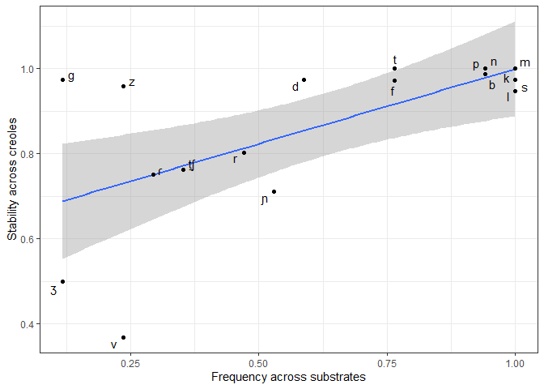<!-- -->

When we consider the correlation between the consonant stability in
creoles and the frequency of these consonants in the substrates only, we
find that there is a weaker correlation (if we compare with the results
above). However, this correlation is statistically significant (p-value:
0.004). Nothing the outliers which are normally voiced consonants.

Typological frequency vs. Substrate frequency

Typological frequency data, extrated from PHOIBLE

``` r
typ_freq <- read.csv("typ_freq.csv")
```

Merge datasets

``` r
#consonant_global_stability <- read.csv("consonant_global_stability.csv")

typ_sta <- left_join(typ_freq, consonant_global_stability, by='LexifierPhoneme')
```

Results of a simple regression

``` r
typ_sta_lm <- lm(TypologicalFreq ~ mglobal, data=typ_sta)
summary(typ_sta_lm)
```

    ## 
    ## Call:
    ## lm(formula = TypologicalFreq ~ mglobal, data = typ_sta)
    ## 
    ## Residuals:
    ##      Min       1Q   Median       3Q      Max 
    ## -0.32614 -0.09953 -0.02402  0.09888  0.29370 
    ## 
    ## Coefficients:
    ##             Estimate Std. Error t value Pr(>|t|)    
    ## (Intercept)  -0.2975     0.1761  -1.689 0.110531    
    ## mglobal       0.9638     0.2035   4.737 0.000223 ***
    ## ---
    ## Signif. codes:  0 '***' 0.001 '**' 0.01 '*' 0.05 '.' 0.1 ' ' 1
    ## 
    ## Residual standard error: 0.1732 on 16 degrees of freedom
    ##   (1 observation deleted due to missingness)
    ## Multiple R-squared:  0.5838, Adjusted R-squared:  0.5577 
    ## F-statistic: 22.44 on 1 and 16 DF,  p-value: 0.0002233

Plot the results

``` r
typ_sta_cor <- ggplot(typ_sta, aes(x = TypologicalFreq, y = mglobal, label = LexifierPhoneme)) +
  geom_smooth(method = "lm") +
  geom_point() +
  xlab("Frequency across world's languages") + ylab("Stability across creoles") # +
 # geom_text(aes(label=V1), hjust=3, vjust=0)


typ_sta_cor + geom_text_repel(aes(label=LexifierPhoneme))
```

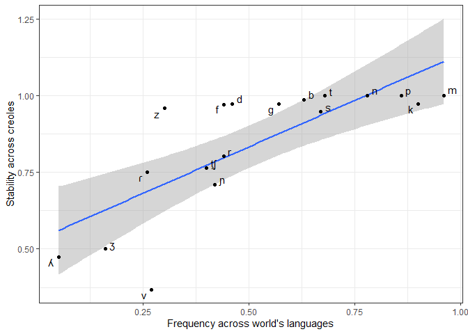<!-- -->

# References

<div id="refs" class="references csl-bib-body hanging-indent">

<div id="ref-CarvalhoLucchesi16" class="csl-entry">

Carvalho, Ana Maria, and Dante Lucchesi. 2016. “Portuguese in Contact.”
In *The Handbook of Portuguese Linguistics*, 41–55. Wiley Blackwell.
<https://doi.org/10.1002/9781118791844.ch3>.

</div>

<div id="ref-Faraclasetal07" class="csl-entry">

Faraclas, Nicholas, Don Walicek, Mervyn Alleyne, Wilfredo Geigel, and
Luis Ortiz. 2007. “The Complexity That Really Matters: The Role of
Political Economy in Creole Genesis.” In *Deconstructing Creole: New
Horizons in Language Creation*, edited by U. Ansaldo, S. J. Matthews,
and L. Lim, 227–64. John Benjamins.
<https://doi.org/10.1075/tsl.73.12far>.

</div>

<div id="ref-lmerTest" class="csl-entry">

Kuznetsova, Alexandra, Per B. Brockhoff, and Rune H. B. Christensen.
2017. “<span class="nocase">lmerTest</span> Package: Tests in Linear
Mixed Effects Models.” *Journal of Statistical Software* 82 (13): 1–26.
<https://doi.org/10.18637/jss.v082.i13>.

</div>

<div id="ref-R" class="csl-entry">

RStudio Team. 2020. *RStudio: Integrated Development Environment for r*.
Boston, MA: RStudio, PBC. <http://www.rstudio.com/>.

</div>

<div id="ref-ggrepel" class="csl-entry">

Slowikowski, Kamil. 2022. *Ggrepel: Automatically Position
Non-Overlapping Text Labels with ’Ggplot2’*.
<https://CRAN.R-project.org/package=ggrepel>.

</div>

<div id="ref-tidyverse" class="csl-entry">

Wickham, Hadley, Mara Averick, Jennifer Bryan, Winston Chang, Lucy
D’Agostino McGowan, Romain François, Garrett Grolemund, et al. 2019.
“Welcome to the <span class="nocase">tidyverse</span>.” *Journal of Open
Source Software* 4 (43): 1686. <https://doi.org/10.21105/joss.01686>.

</div>

<div id="ref-mgcv" class="csl-entry">

Wood, S. N. 2004. “Stable and Efficient Multiple Smoothing Parameter
Estimation for Generalized Additive Models.” *Journal of the American
Statistical Association* 99 (467): 673–86.

</div>

<div id="ref-knitr" class="csl-entry">

Xie, Yihui. 2021. *Knitr: A General-Purpose Package for Dynamic Report
Generation in r*. <https://yihui.org/knitr/>.

</div>

</div>
