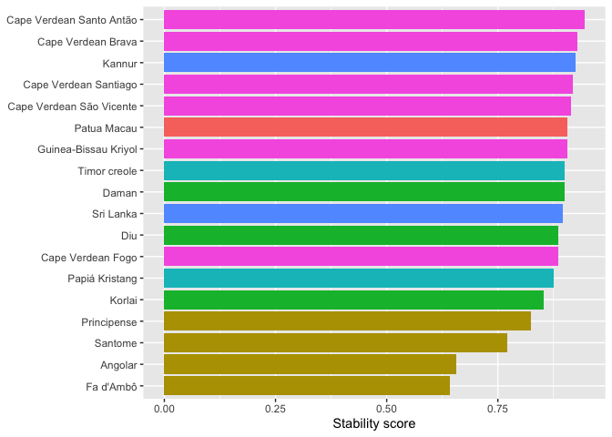
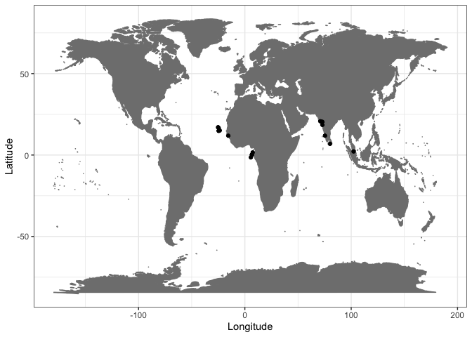

Supplementary materials for: Consonant stability in Portuguese-based
creoles
================
Carlos Silva and Steven Moran
(19 November, 2021)

-   [Overview](#overview)
-   [Creole stability](#creole-stability)
-   [Segment stability](#segment-stability)
-   [Word position](#word-position)
-   [References](#references)

# Overview

Supplementary materials for [Consonant Stability in Portuguese-based
creoles](https://www.overleaf.com/project/60cdac0dd5871295e0f608fc).
Silva, Carlos and Steven Moran. Work in progress.

In this report, we use R (R Core Team 2021) and the following packages
(Wickham et al. 2019; Xie 2021).

``` r
library(tidyverse)
library(knitr)
```

First load the dataset.

``` r
database <- read_csv('database.csv')
```

The data look like this.

``` r
database %>% head() %>% kable()
```

| language    | class | position     | lexifier\_phoneme | creole\_phoneme | place\_stability | manner\_stability | example     | reference        | gloss      |
|:------------|:------|:-------------|:------------------|:----------------|-----------------:|------------------:|:------------|:-----------------|:-----------|
| Principense | Stops | Word-initial | p                 | p               |                1 |                 1 | \[ˈpɛnɛ\]   | Maurer 2009: 232 | feather    |
| Principense | Stops | word-medial  | p                 | p               |                1 |                 1 | \[t͡ʃipa\]   | Maurer 2009: 238 | guts       |
| Principense | Stops | Word-initial | b                 | b               |                1 |                 1 | \[bwɛga\]   | Maurer 2009: 216 | belly      |
| Principense | Stops | word-medial  | b                 | b               |                1 |                 1 | \[kaˈbɛlu\] | Maurer 2009: 221 | hair       |
| Principense | Stops | Word-initial | t                 | t               |                1 |                 1 | \[ˈtudu\]   | Maurer 2009: 237 | everything |
| Principense | Stops | word-medial  | t                 | t               |                1 |                 1 | \[mata\]    | Maurer 2009: 227 | to kill    |

# Creole stability

Which creoles in the sample are more or less stable overall?

First, we prepare the data for analysis.

``` r
creole_stability <- database %>% select(language, place_stability, manner_stability)
creole_stability$place_stability = as.numeric(creole_stability$place_stability)
creole_stability$manner_stability = as.numeric(creole_stability$manner_stability)
```

Next, we calculate the stability measure for each creole.

``` r
global_creole_stability <- mutate(creole_stability, global_stability = (place_stability + manner_stability)/2)

final_results <- global_creole_stability %>% group_by(language) %>% summarize(m = mean(global_stability, na.rm = TRUE))
```

Lastly, we plot the results.

``` r
region <- c("GG", "UG", "UG", "UG", "UG", "UG", "NI", "NI", "GG", "UG", "SI", "NI", "SA", "GG", "GG", "SI")

final_results_region <- cbind(final_results, region)

ggplot(final_results_region) + 
  geom_bar(aes(x = m, y = reorder(language, m), fill = region), 
           stat = "identity", show.legend = FALSE)
```

<!-- -->

# Segment stability

Which segments are the most stable across creoles in the language
sample?

First we prepare the data.

``` r
data_by_phoneme <- database %>% select(lexifier_phoneme, place_stability, manner_stability)

data_by_phoneme$place_stability = as.numeric(data_by_phoneme$place_stability)

data_by_phoneme$manner_stability = as.numeric(data_by_phoneme$manner_stability)
```

Then we calculate stability of place and manner for each phoneme.

``` r
place_results <- data_by_phoneme %>% group_by(lexifier_phoneme) %>% summarize(mplace = mean(place_stability, na.rm = TRUE))

manner_results <- data_by_phoneme %>% group_by(lexifier_phoneme) %>% summarize(mmanner = mean(manner_stability, na.rm = TRUE))

consonant_stability <- left_join(place_results, manner_results, by = "lexifier_phoneme")

class <- c("nasal", "rothic", "lateral", "fric", "stop", "stop", "fric", "stop", "stop", "lateral", "nasal", "nasal", "stop", "rothic", "fric", "stop", "affricate", "fric", "fric")

consonant_stability_class <- cbind(consonant_stability, class)
```

Next, we plot the results.

``` r
ggplot(consonant_stability, aes(y=mmanner, x=mplace, label = lexifier_phoneme, color=class)) + 
  geom_point(position= "dodge") + geom_text(aes(label=lexifier_phoneme), hjust=3, vjust=0)
```

    ## Warning: Width not defined. Set with `position_dodge(width = ?)`

<!-- -->

Here is an alternative view for the global results.

``` r
consonant_global_stability <- mutate(consonant_stability_class, mglobal = (mmanner + mplace)/2)

ggplot(consonant_global_stability) + geom_bar(aes(x = mglobal, y = reorder(lexifier_phoneme, mglobal), fill = class), stat = "identity", show.legend = TRUE)
```

<!-- -->

# Word position

Next we ask, does word position influence stability?

First, data prepartion.

``` r
data_by_position <- database %>% select(position, lexifier_phoneme, place_stability, manner_stability) %>% mutate(position = tolower(position))

data_by_position$place_stability = as.numeric(data_by_position$place_stability)

data_by_position$manner_stability = as.numeric(data_by_position$manner_stability)
```

Next, calculate stability for each segment according to its word
position.

``` r
position_stability <- mutate(data_by_position, global_stability = (place_stability + manner_stability)/2)

position_results <- position_stability %>% group_by(position, lexifier_phoneme) %>% summarize(m = mean(global_stability, na.rm = TRUE))
```

    ## `summarise()` has grouped output by 'position'. You can override using the `.groups` argument.

And plot the results for all segments.

``` r
position_results$position <- factor(position_results$position, levels = c('word-initial', 'word-medial', 'word-final'))

ggplot(position_results, aes(x= lexifier_phoneme, y=m, fill=position)) + 
  geom_col(position = position_dodge2(width= 0.9, preserve = "single"))
```

<!-- -->

Plot the results for segments that show differences.

``` r
position_results1 <- position_results %>% pivot_wider(names_from = position, values_from = m)

different_position <- subset(position_results1, position_results1$`word-initial` != position_results1$`word-medial` | position_results1$`word-final` != position_results1$`word-medial`)

different_position_results <- different_position %>% pivot_longer(c(`word-initial`, `word-medial`, `word-final`), names_to = "position", values_to = "m")

different_position_results$position <- factor(different_position_results$position, levels = c('word-initial', 'word-medial', 'word-final'))

ggplot(different_position_results, aes(x= lexifier_phoneme, y=m, fill=position)) + 
  geom_col(position = position_dodge2(width= 0.9, preserve = "single"))
```

    ## Warning: Removed 8 rows containing missing values (geom_col).

<!-- -->

# References

<div id="refs" class="references csl-bib-body hanging-indent">

<div id="ref-R" class="csl-entry">

R Core Team. 2021. *R: A Language and Environment for Statistical
Computing*. Vienna, Austria: R Foundation for Statistical Computing.
<https://www.R-project.org/>.

</div>

<div id="ref-tidyverse" class="csl-entry">

Wickham, Hadley, Mara Averick, Jennifer Bryan, Winston Chang, Lucy
D’Agostino McGowan, Romain François, Garrett Grolemund, et al. 2019.
“Welcome to the <span class="nocase">tidyverse</span>.” *Journal of Open
Source Software* 4 (43): 1686. <https://doi.org/10.21105/joss.01686>.

</div>

<div id="ref-knitr" class="csl-entry">

Xie, Yihui. 2021. *Knitr: A General-Purpose Package for Dynamic Report
Generation in r*. <https://yihui.org/knitr/>.

</div>

</div>
