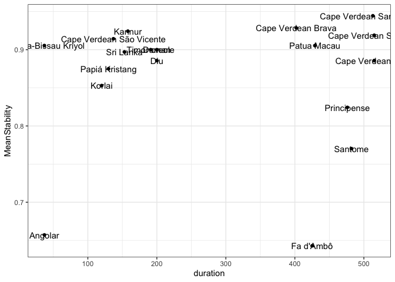
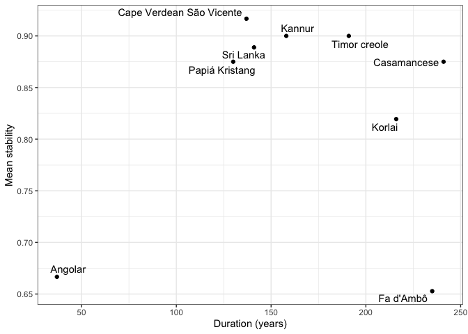

Supplementary materials for: Consonant stability in Portuguese-based
creoles
================
Carlos Silva and Steven Moran
(02 December, 2021)

-   [Overview](#overview)
-   [Creole stability](#creole-stability)
-   [Segment stability](#segment-stability)
-   [Word position](#word-position)
-   [References](#references)

# Overview

Supplementary materials for [Consonant Stability in Portuguese-based
creoles](https://www.overleaf.com/project/60cdac0dd5871295e0f608fc).
Silva, Carlos and Steven Moran. Work in progress.

In this report, we use R (R Core Team 2021) and the following packages
(Wickham et al. 2019; Xie 2021).

``` r
library(tidyverse)
library(knitr)
```

First load the dataset.

``` r
database <- read_csv('https://raw.githubusercontent.com/CreoPhon/CreoPhonPt/main/Creoles.csv?token=AAIGDLU6EGPIBXYP3ITSDGDBVCSA6')
```

The data look like this.

``` r
database %>% head() %>% kable()
```

| Language    | Area           | Lexifier   | FirstMajorSettlement | EndOfInfluence | ContactConditions | LanguageContact | Class | Position     | LexifierPhoneme | CreolePhoneme | PlaceStability | MannerStability | Word        | Gloss      | Source            |
|:------------|:---------------|:-----------|---------------------:|---------------:|:------------------|:----------------|:------|:-------------|:----------------|:--------------|---------------:|----------------:|:------------|:-----------|:------------------|
| Principense | Gulf of Guinea | Portuguese |                 1499 |           1975 | Slavery           | Edo             | Stops | word-initial | p               | p             |              1 |               1 | \[ˈpɛnɛ\]   | feather    | Maurer2009\[232\] |
| Principense | Gulf of Guinea | Portuguese |                 1499 |           1975 | Slavery           | Edo             | Stops | word-medial  | p               | p             |              1 |               1 | \[t̠ʃipa\]   | guts       | Maurer2009\[238\] |
| Principense | Gulf of Guinea | Portuguese |                 1499 |           1975 | Slavery           | Edo             | Stops | word-initial | b               | b             |              1 |               1 | \[bwɛga\]   | belly      | Maurer2009\[216\] |
| Principense | Gulf of Guinea | Portuguese |                 1499 |           1975 | Slavery           | Edo             | Stops | word-medial  | b               | b             |              1 |               1 | \[kaˈbɛlu\] | hair       | Maurer2009\[221\] |
| Principense | Gulf of Guinea | Portuguese |                 1499 |           1975 | Slavery           | Edo             | Stops | word-initial | t               | t             |              1 |               1 | \[ˈtudu\]   | everything | Maurer2009\[237\] |
| Principense | Gulf of Guinea | Portuguese |                 1499 |           1975 | Slavery           | Edo             | Stops | word-medial  | t               | t             |              1 |               1 | \[mata\]    | to kill    | Maurer2009\[227\] |

# Creole stability

Which creoles in the sample are more or less stable overall?

First, we prepare the data for analysis.

``` r
CreoleStability <- database %>% select(Language, Area, PlaceStability, MannerStability)
CreoleStability$PlaceStability = as.numeric(CreoleStability$PlaceStability)
CreoleStability$MannerStability = as.numeric(CreoleStability$MannerStability)
```

Next, we calculate the stability measure for each creole.

``` r
GlobalCreoleStability <- mutate(CreoleStability, GlobalStability = (PlaceStability + MannerStability)/2)

final_results <- GlobalCreoleStability %>% group_by(Language, Area) %>% summarize(m = mean(GlobalStability, na.rm = TRUE))
```

    ## `summarise()` has grouped output by 'Language'. You can override using the `.groups` argument.

Lastly, we plot the results.

``` r
ggplot(final_results) + 
  geom_bar(aes(x = m, y = reorder(Language, m), fill = Area), 
           stat = "identity", show.legend = FALSE) +
  theme(axis.title.y = element_blank()) +
  labs(x = "Stability score")
```

<!-- -->

We have the overall stability values. What are these in relation to the
duration of contact?

We can get the length of contact from CreoPhonPT.

``` r
cp <- database

tmp <- cp %>% select(Language, `EndOfInfluence`, `FirstMajorSettlement`) %>% distinct()
tmp$duration <- tmp$`EndOfInfluence` - tmp$`FirstMajorSettlement`

tmp <- left_join(tmp, final_results, by=c("Language"))
```

Duration in years.

``` r
tmp <- tmp %>% rename(MeanStability = m)
tmp %>% select(Language, duration, `FirstMajorSettlement`, `EndOfInfluence`, MeanStability) %>% arrange(desc(duration)) %>% kable()
```

| Language                 | duration | FirstMajorSettlement | EndOfInfluence | MeanStability |
|:-------------------------|---------:|---------------------:|---------------:|--------------:|
| Cape Verdean Santiago    |      515 |                 1460 |           1975 |     0.9189189 |
| Cape Verdean Fogo        |      515 |                 1460 |           1975 |     0.8857143 |
| Cape Verdean Santo Antão |      513 |                 1462 |           1975 |     0.9444444 |
| Santome                  |      482 |                 1493 |           1975 |     0.7702703 |
| Principense              |      476 |                 1499 |           1975 |     0.8243243 |
| Patua Macau              |      429 |                 1570 |           1999 |     0.9054054 |
| Fa d’Ambô                |      425 |                 1543 |           1968 |     0.6428571 |
| Cape Verdean Brava       |      402 |                 1573 |           1975 |     0.9285714 |
| Daman                    |      200 |                 1540 |           1740 |     0.9000000 |
| Diu                      |      200 |                 1540 |           1740 |     0.8857143 |
| Timor creole             |      191 |                 1769 |           1960 |     0.9000000 |
| Kannur                   |      158 |                 1505 |           1663 |     0.9242424 |
| Sri Lanka                |      153 |                 1505 |           1658 |     0.8970588 |
| Cape Verdean São Vicente |      137 |                 1838 |           1975 |     0.9142857 |
| Papiá Kristang           |      130 |                 1511 |           1641 |     0.8750000 |
| Korlai                   |      120 |                 1520 |           1640 |     0.8529412 |
| Angolar                  |       37 |                 1493 |           1530 |     0.6571429 |
| Guinea-Bissau Kriyol     |       37 |                 1493 |           1530 |     0.9054054 |

There does not seem to be a relationship between overall duration and
overall stability.

``` r
ggplot(tmp, aes(x=duration, y=MeanStability)) +
  geom_point()
```

<!-- -->

``` r
ggplot(tmp, aes(x=duration, y=MeanStability)) +
  geom_point() +
  geom_text(label=tmp$Language)
```

<!-- -->

``` r
msd <- lm(MeanStability ~ duration, data=tmp)
summary(msd)
```

    ## 
    ## Call:
    ## lm(formula = MeanStability ~ duration, data = tmp)
    ## 
    ## Residuals:
    ##       Min        1Q    Median        3Q       Max 
    ## -0.221577 -0.002688  0.036798  0.051036  0.079053 
    ## 
    ## Coefficients:
    ##              Estimate Std. Error t value Pr(>|t|)    
    ## (Intercept) 8.598e-01  4.086e-02  21.042 4.37e-13 ***
    ## duration    1.088e-05  1.227e-04   0.089     0.93    
    ## ---
    ## Signif. codes:  0 '***' 0.001 '**' 0.01 '*' 0.05 '.' 0.1 ' ' 1
    ## 
    ## Residual standard error: 0.09017 on 16 degrees of freedom
    ## Multiple R-squared:  0.0004911,  Adjusted R-squared:  -0.06198 
    ## F-statistic: 0.007862 on 1 and 16 DF,  p-value: 0.9304

However, there does seem to be two groups of languages – ones that
belong to “long duration” (&gt;= 400 years) and those that belonw to
“short duration” (&lt;= 200 years) (Nicholas Lester, pc).

We can try to split the data and rerun the models, but we note that
there are very few data points.

``` r
tmp <- tmp %>% mutate(duration_group = ifelse(duration <= 200, 'short', 'long'))
tmp_short <- tmp %>% filter(duration <= 200)
tmp_long <- tmp %>% filter(duration > 200)
```

``` r
ggplot(tmp_short, aes(x=duration, y=MeanStability)) +
  geom_point()
```

<!-- -->

``` r
ggplot(tmp_short, aes(x=duration, y=MeanStability)) +
  geom_point() +
  geom_text(label=tmp_short$Language)
```

<!-- -->

``` r
ggplot(tmp_long, aes(x=duration, y=MeanStability)) +
  geom_point()
```

<!-- -->

``` r
ggplot(tmp_long, aes(x=duration, y=MeanStability)) +
  geom_point() +
  geom_text(label=tmp_long$Language)
```

<!-- --> Or perhaps a
single model with an interaction term MeanSim \~ duration, group \*
duration.

``` r
msd <- lm(MeanStability ~ duration + duration_group * duration, data=tmp)
summary(msd)
```

    ## 
    ## Call:
    ## lm(formula = MeanStability ~ duration + duration_group * duration, 
    ##     data = tmp)
    ## 
    ## Residuals:
    ##       Min        1Q    Median        3Q       Max 
    ## -0.180674 -0.029112  0.006105  0.041142  0.120003 
    ## 
    ## Coefficients:
    ##                               Estimate Std. Error t value Pr(>|t|)
    ## (Intercept)                  0.5470360  0.3391096   1.613    0.129
    ## duration                     0.0006506  0.0007192   0.905    0.381
    ## duration_groupshort          0.2212025  0.3465288   0.638    0.534
    ## duration:duration_groupshort 0.0001047  0.0008665   0.121    0.906
    ## 
    ## Residual standard error: 0.08632 on 14 degrees of freedom
    ## Multiple R-squared:  0.1984, Adjusted R-squared:  0.02667 
    ## F-statistic: 1.155 on 3 and 14 DF,  p-value: 0.3615

``` r
ggplot(tmp, aes(x = duration, y = MeanStability, color = duration_group)) +
  geom_smooth(method = "lm") +
  geom_point()
```

    ## `geom_smooth()` using formula 'y ~ x'

<!-- -->

Nicholas Lester notes: The variability in the two groups is very
different. The direction of the effect is interesting: shorter durations
yield more stability more consistently. Over time, the variability in
mean stability increases. Time is “destabillizing the pattern of
stability.”

And we can also increase the number of observations by running the
analysis at the segment level, rather than on mean stability. Here we
use the format from the GlobalCreoleStability object for modeling that
is created below.

# Segment stability

Which segments are the most stable across creoles in the language
sample?

First we prepare the data.

``` r
data_by_phoneme <- database %>% select(LexifierPhoneme, PlaceStability, MannerStability)
data_by_phoneme$PlaceStability = as.numeric(data_by_phoneme$PlaceStability)
data_by_phoneme$MannerStability = as.numeric(data_by_phoneme$MannerStability)
```

Then we calculate stability of place and manner for each phoneme.

``` r
place_results <- data_by_phoneme %>% group_by(LexifierPhoneme) %>% summarize(mplace = mean(PlaceStability, na.rm = TRUE))

manner_results <- data_by_phoneme %>% group_by(LexifierPhoneme) %>% summarize(mmanner = mean(MannerStability, na.rm = TRUE))

consonant_stability <- left_join(place_results, manner_results, by = "LexifierPhoneme")

class <- c("nasal", "rhotic", "lateral", "fricative", "stop", "stop", "fricative", "stop", "stop", "lateral", "nasal", "nasal", "stop", "rhotic", "fricative", "stop", "affricate", "fricative", "fricative")

consonant_stability_class <- cbind(consonant_stability, class)
```

Next, we plot the results.

``` r
# TODO: fix the class "dots"
ggplot(consonant_stability, aes(y = mmanner, x = mplace, label = LexifierPhoneme, color=class)) +
  geom_point(position= "dodge") + 
  geom_text(aes(label=LexifierPhoneme), hjust=3, vjust=0) +
  theme(axis.title.x = element_blank(),
        axis.title.y = element_blank())
```

    ## Warning: Width not defined. Set with `position_dodge(width = ?)`

<!-- -->

Here is an alternative view for the global results.

``` r
consonant_global_stability <- mutate(consonant_stability_class, mglobal = (mmanner + mplace)/2)

ggplot(consonant_global_stability) + 
  geom_bar(aes(x = mglobal, 
               y = reorder(LexifierPhoneme, mglobal),
               fill = class), stat = "identity", show.legend = TRUE) +
  labs(x = "Stability score", y = "Phoneme", fill = "Manner")
```

<!-- -->

# Word position

Next we ask, does word position influence stability?

First, data prepartion.

``` r
data_by_position <- database %>% select(Position, LexifierPhoneme, PlaceStability, MannerStability) %>% mutate(Position = tolower(Position))

data_by_position$PlaceStability <- as.numeric(data_by_position$PlaceStability)

data_by_position$MannerStability <- as.numeric(data_by_position$MannerStability)
```

Next, calculate stability for each segment according to its word
position.

``` r
position_stability <- mutate(data_by_position, GlobalStability = (PlaceStability + MannerStability)/2)

position_results <- position_stability %>% group_by(LexifierPhoneme, Position) %>% summarize(m = mean(GlobalStability, na.rm = TRUE))
```

    ## `summarise()` has grouped output by 'LexifierPhoneme'. You can override using the `.groups` argument.

And plot the results for all segments.

``` r
position_results$Position <- factor(position_results$Position, levels = c('word-initial', 'word-medial', 'word-final'))

ggplot(position_results, aes(x = LexifierPhoneme, y = m, fill = Position)) + 
  geom_col(position = position_dodge2(width = 0.9, preserve = "single")) +
  theme(axis.title.x = element_blank(),
        axis.title.y = element_blank())
```

<!-- -->

Flip horizontally.

``` r
ggplot(position_results) + 
  geom_bar(aes(x = m,
               y = reorder(LexifierPhoneme, m),
               fill = Position), 
           stat = "identity", 
           show.legend = TRUE,
           position = "dodge2") +
  labs(x = "Stability score", y = "Phoneme", fill = "Position")
```

<!-- -->

Plot the results for segments that show differences.

``` r
# TODO: update what we show, flip horizontally, change colors
position_results1 <- position_results %>% pivot_wider(names_from = Position, values_from = m)

different_position <- subset(position_results1, position_results1$`word-initial` != position_results1$`word-medial` | position_results1$`word-final` != position_results1$`word-medial`)

different_position_results <- different_position %>% pivot_longer(c(`word-initial`, `word-medial`, `word-final`), names_to = "Position", values_to = "m")

different_position_results$Position <- factor(different_position_results$Position, levels = c('word-initial', 'word-medial', 'word-final'))

ggplot(different_position_results, 
       aes(x = LexifierPhoneme, y = m, fill = Position)) + 
  geom_col(position = position_dodge2(width = 0.9, preserve = "single"))
```

    ## Warning: Removed 8 rows containing missing values (geom_col).

<!-- -->

Flip horizontally.

``` r
# TODO: reorder doesn't work here
ggplot(different_position_results) + 
  geom_bar(aes(x = m,
               y = reorder(LexifierPhoneme, m),
               fill = Position), 
           stat = "identity", 
           show.legend = TRUE,
           position = "dodge2") +
  labs(x = "Stability score", y = "Phoneme", fill = "Position")
```

    ## Warning: Removed 8 rows containing missing values (geom_bar).

<!-- -->

# References

<div id="refs" class="references csl-bib-body hanging-indent">

<div id="ref-R" class="csl-entry">

R Core Team. 2021. *R: A Language and Environment for Statistical
Computing*. Vienna, Austria: R Foundation for Statistical Computing.
<https://www.R-project.org/>.

</div>

<div id="ref-tidyverse" class="csl-entry">

Wickham, Hadley, Mara Averick, Jennifer Bryan, Winston Chang, Lucy
D’Agostino McGowan, Romain François, Garrett Grolemund, et al. 2019.
“Welcome to the <span class="nocase">tidyverse</span>.” *Journal of Open
Source Software* 4 (43): 1686. <https://doi.org/10.21105/joss.01686>.

</div>

<div id="ref-knitr" class="csl-entry">

Xie, Yihui. 2021. *Knitr: A General-Purpose Package for Dynamic Report
Generation in r*. <https://yihui.org/knitr/>.

</div>

</div>
