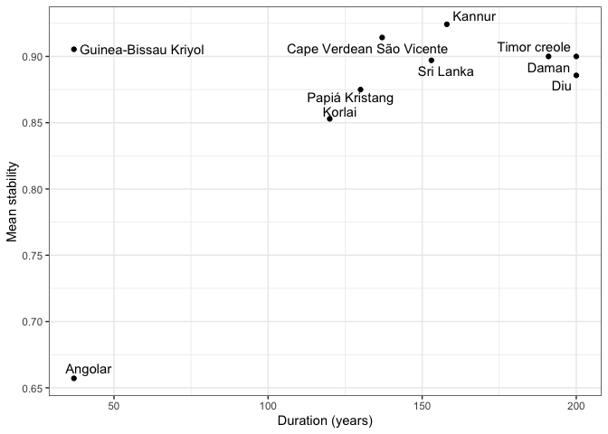
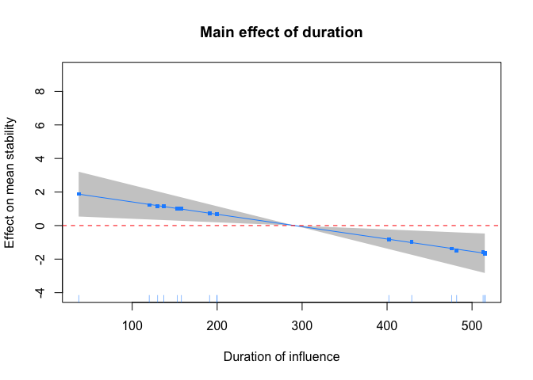
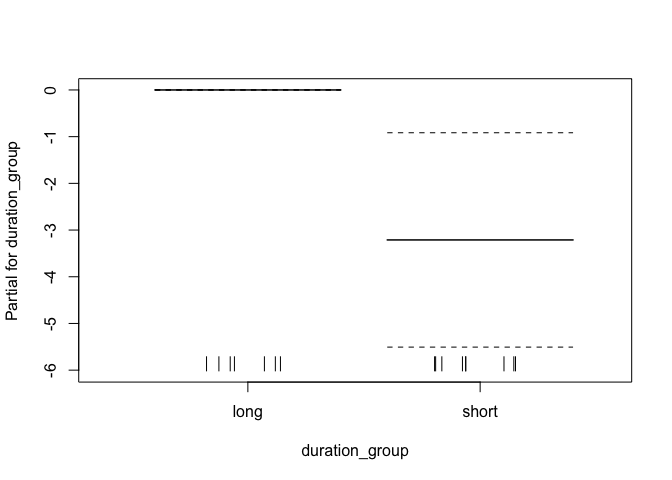
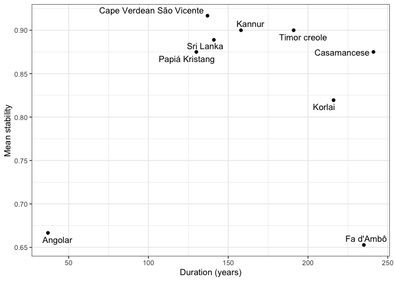
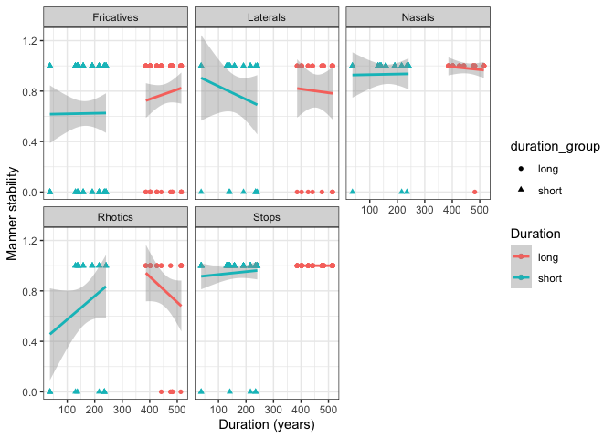
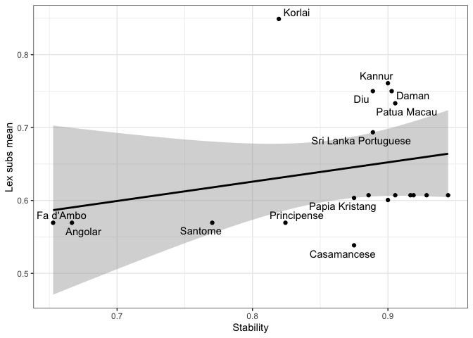
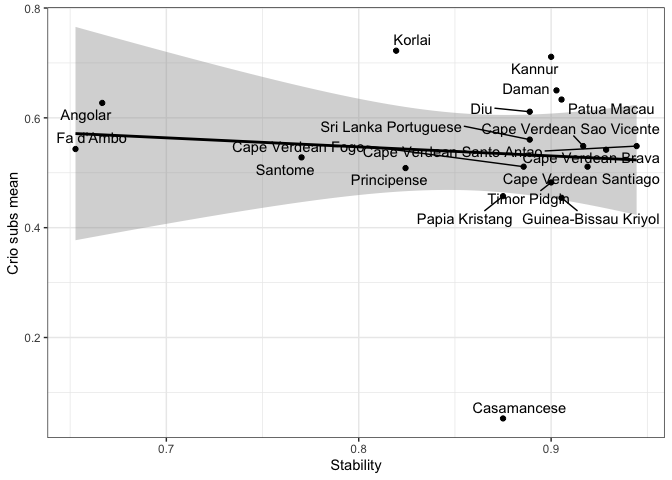
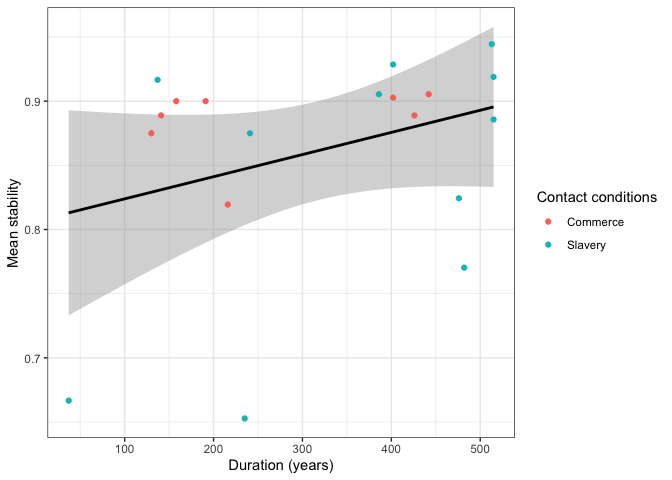

Supplementary materials for: Consonant stability in Portuguese-based
creoles
================
(03 January, 2023)

-   <a href="#overview" id="toc-overview">Overview</a>
-   <a href="#creole-stability" id="toc-creole-stability">Creole
    stability</a>
-   <a href="#duration" id="toc-duration">Duration</a>
-   <a href="#duration-effects-on-the-segment-level"
    id="toc-duration-effects-on-the-segment-level">Duration effects on the
    segment level</a>
-   <a href="#segment-stability" id="toc-segment-stability">Segment
    stability</a>
-   <a href="#word-position" id="toc-word-position">Word position</a>
-   <a href="#conditions-of-contact"
    id="toc-conditions-of-contact">Conditions of contact</a>
-   <a href="#references" id="toc-references">References</a>

<!-- author: "Steven Moran, Carlos Silva and Nicholas A. Lester" 

  pdf_document:
    latex_engine: xelatex
    toc: true
-->

# Overview

<!-- Supplementary materials for [Consonant Stability in Portuguese-based creoles](https://www.overleaf.com/project/60cdac0dd5871295e0f608fc). Silva, Carlos and Steven Moran. Work in progress. -->

Supplementary materials for, “Consonant Stability in Portuguese-based
creoles”. In this report, we provide code in R (RStudio Team 2020) and
we use these R libraries (Wickham et al. 2019; Xie 2021; Slowikowski
2022):

``` r
library(tidyverse)
library(knitr)
library(ggrepel)

# Set the theme for all figures
theme_set(theme_bw())
```

Load the data set.

``` r
database <- read_csv('database.csv')
```

The data look like this:

``` r
database %>% head() %>% kable()
```

| Language    | Macroarea | Area           | Lexifier   | FirstMajorSettlement | EndOfInfluence | ContactConditions | LanguageContact | Class | Position     | LexifierPhoneme | CreolePhoneme | PlaceStability | MannerStability | Word        | Gloss      | Source            |
|:------------|:----------|:---------------|:-----------|---------------------:|---------------:|:------------------|:----------------|:------|:-------------|:----------------|:--------------|---------------:|----------------:|:------------|:-----------|:------------------|
| Principense | Africa    | Gulf of Guinea | Portuguese |                 1499 |           1975 | Slavery           | Edo             | Stops | word-initial | p               | p             |              1 |               1 | \[ˈpɛnɛ\]   | feather    | Maurer2009\[232\] |
| Principense | Africa    | Gulf of Guinea | Portuguese |                 1499 |           1975 | Slavery           | Edo             | Stops | word-medial  | p               | p             |              1 |               1 | \[t̠ʃipa\]   | guts       | Maurer2009\[238\] |
| Principense | Africa    | Gulf of Guinea | Portuguese |                 1499 |           1975 | Slavery           | Edo             | Stops | word-initial | b               | b             |              1 |               1 | \[bwɛga\]   | belly      | Maurer2009\[216\] |
| Principense | Africa    | Gulf of Guinea | Portuguese |                 1499 |           1975 | Slavery           | Edo             | Stops | word-medial  | b               | b             |              1 |               1 | \[kaˈbɛlu\] | hair       | Maurer2009\[221\] |
| Principense | Africa    | Gulf of Guinea | Portuguese |                 1499 |           1975 | Slavery           | Edo             | Stops | word-initial | t               | t             |              1 |               1 | \[ˈtudu\]   | everything | Maurer2009\[237\] |
| Principense | Africa    | Gulf of Guinea | Portuguese |                 1499 |           1975 | Slavery           | Edo             | Stops | word-medial  | t               | t             |              1 |               1 | \[mata\]    | to kill    | Maurer2009\[227\] |

We extend the database with some additional variables. First, duration
of contact.

``` r
database$duration <- database$`EndOfInfluence` - database$`FirstMajorSettlement`
```

Next, a variable of global stability.

``` r
database <- mutate(database, GlobalStability = (PlaceStability + MannerStability)/2)
# table(database$Language, database$GlobalStability)
```

Also, a categorical variable for duration.

``` r
database <- database %>% mutate(duration_group = ifelse(duration <= 200, 'short', 'long'))
```

And a categorical variable for changes in manner and/or place. Stability
in the database is ‘1’ (no change) and ‘0’ (change).

``` r
database <- database %>% mutate(categorical_stability = ifelse(PlaceStability == 1 & MannerStability == 1, 'no manner/no place', NA))

database <- database %>% mutate(categorical_stability = ifelse(PlaceStability == 1 & MannerStability == 0, 'manner/no place', categorical_stability))

database <- database %>% mutate(categorical_stability = ifelse(PlaceStability == 0 & MannerStability == 1, 'no manner/place', categorical_stability))

database <- database %>% mutate(categorical_stability = ifelse(PlaceStability == 0 & MannerStability == 0, 'manner/place', categorical_stability))

table(database$categorical_stability)
```

    ## 
    ##    manner/no place       manner/place no manner/no place    no manner/place 
    ##                 43                 54                517                 24

# Creole stability

Which creoles in the sample are more or less stable overall?

``` r
creole_stability <- database %>% group_by(Language, Area, duration, duration_group, ContactConditions) %>% summarize(MeanStability = mean(GlobalStability, na.rm = TRUE))
```

Plot it by area.

``` r
ggplot(creole_stability) + 
  geom_bar(aes(x = MeanStability, y = reorder(Language, MeanStability), fill = Area), 
           stat = "identity", show.legend = TRUE) +
  theme(axis.title.y = element_blank()) +
  labs(x = "Stability score")
```

<!-- -->

``` r
table(creole_stability$Area)
```

    ## 
    ##   Eastern Asia Gulf of Guinea Northern India Southeast Asia Southern India 
    ##              1              4              3              2              2 
    ##   Upper Guinea 
    ##              6

Plot it by conditions of contact.

``` r
ggplot(creole_stability) + 
  geom_bar(aes(x = MeanStability, y = reorder(Language, MeanStability), fill = ContactConditions), 
           stat = "identity", show.legend = TRUE) +
  theme(axis.title.y = element_blank()) +
  labs(x = "Stability score")
```

<!-- -->

# Duration

We have the overall stability values. What are these in relation to the
duration of contact?

There does not seem to be a relationship between overall duration and
overall stability.

``` r
ggplot(creole_stability, aes(x=duration, y=MeanStability)) +
  geom_point() +
  xlab("Duration (years)") +
  ylab("Mean stability")
```

<!-- -->

``` r
ggplot(creole_stability, aes(x=duration, y=MeanStability)) +
  geom_point() +
  geom_text_repel(aes(label = creole_stability$Language)) +
  xlab("Duration (years)") +
  ylab("Mean stability")
```

<!-- -->

Results from the simple regression.

``` r
msd <- lm(MeanStability ~ duration, data=creole_stability)
summary(msd)
```

    ## 
    ## Call:
    ## lm(formula = MeanStability ~ duration, data = creole_stability)
    ## 
    ## Residuals:
    ##       Min        1Q    Median        3Q       Max 
    ## -0.221577 -0.002688  0.036798  0.051036  0.079053 
    ## 
    ## Coefficients:
    ##              Estimate Std. Error t value Pr(>|t|)    
    ## (Intercept) 8.598e-01  4.086e-02  21.042 4.37e-13 ***
    ## duration    1.088e-05  1.227e-04   0.089     0.93    
    ## ---
    ## Signif. codes:  0 '***' 0.001 '**' 0.01 '*' 0.05 '.' 0.1 ' ' 1
    ## 
    ## Residual standard error: 0.09017 on 16 degrees of freedom
    ## Multiple R-squared:  0.0004911,  Adjusted R-squared:  -0.06198 
    ## F-statistic: 0.007862 on 1 and 16 DF,  p-value: 0.9304

However, there does seem to be two groups of languages – ones that
belong to “long duration” (\>= 400 years) and those that below to “short
duration” (\<= 200 years).

We can try to split the data and rerun the models, but we note that
there are very few data points.

``` r
tmp_short <- creole_stability %>% filter(duration <= 200)
tmp_long <- creole_stability %>% filter(duration > 200)
```

``` r
ggplot(tmp_short, aes(x=duration, y=MeanStability)) +
  geom_point() +
  xlab("Duration (years)") +
  ylab("Mean stability")
```

<!-- -->

``` r
ggplot(tmp_short, aes(x=duration, y=MeanStability)) +
  geom_point() +
  geom_text_repel(aes(label = tmp_short$Language)) +
  xlab("Duration (years)") +
  ylab("Mean stability")
```

<!-- -->

``` r
ggplot(tmp_long, aes(x=duration, y=MeanStability)) +
  geom_point() +
  xlab("Duration (years)") +
  ylab("Mean stability")
```

<!-- -->

``` r
ggplot(tmp_long, aes(x=duration, y=MeanStability)) +
  geom_point() +
  geom_text_repel(aes(label = tmp_long$Language)) +
  xlab("Duration (years)") +
  ylab("Mean stability")
```

<!-- -->

Or perhaps a single model with an interaction term MeanSim \~ duration,
group \* duration.

``` r
msd <- lm(MeanStability ~ duration + duration_group * duration, data=creole_stability)
summary(msd)
```

    ## 
    ## Call:
    ## lm(formula = MeanStability ~ duration + duration_group * duration, 
    ##     data = creole_stability)
    ## 
    ## Residuals:
    ##       Min        1Q    Median        3Q       Max 
    ## -0.180674 -0.029112  0.006105  0.041142  0.120003 
    ## 
    ## Coefficients:
    ##                               Estimate Std. Error t value Pr(>|t|)
    ## (Intercept)                  0.5470360  0.3391096   1.613    0.129
    ## duration                     0.0006506  0.0007192   0.905    0.381
    ## duration_groupshort          0.2212025  0.3465288   0.638    0.534
    ## duration:duration_groupshort 0.0001047  0.0008665   0.121    0.906
    ## 
    ## Residual standard error: 0.08632 on 14 degrees of freedom
    ## Multiple R-squared:  0.1984, Adjusted R-squared:  0.02667 
    ## F-statistic: 1.155 on 3 and 14 DF,  p-value: 0.3615

``` r
ggplot(creole_stability, aes(x = duration, y = MeanStability, color = duration_group)) +
  geom_smooth(method = "lm") +
  geom_point() +
  xlab("Duration (years)") +
  ylab("Mean stability") +
  labs(color = "Duration group")
```

    ## `geom_smooth()` using formula 'y ~ x'

<!-- -->

The variability in the two groups is very different. The direction of
the effect is interesting: shorter durations yield more stability more
consistently. Over time, the variability in mean stability increases.
Time is “destabillizing the pattern of stability”.

But it looks like you might have something tastier on your hands. The
creoles appear to be bouncing back toward the lexifier over time (based
on the duration findings; but perhaps I misunderstand).

And we can also increase the number of observations by running the
analysis at the segment level, rather than on mean stability.

Exploratory stuff with GAMs.

``` r
library(mgcv)
```

    ## Loading required package: nlme

    ## 
    ## Attaching package: 'nlme'

    ## The following object is masked from 'package:dplyr':
    ## 
    ##     collapse

    ## This is mgcv 1.8-40. For overview type 'help("mgcv-package")'.

``` r
# Factorize duration_group
creole_stability$duration_group = as.factor(creole_stability$duration_group)

# Model with an interaction between duration_group and duration
# (with maximum of cubic-spline fit)
msd.gam <- gam(MeanStability ~ duration_group + s(duration, k=3) + s(duration, by=duration_group, k=3), data=creole_stability)

summary(msd.gam)
```

    ## 
    ## Family: gaussian 
    ## Link function: identity 
    ## 
    ## Formula:
    ## MeanStability ~ duration_group + s(duration, k = 3) + s(duration, 
    ##     by = duration_group, k = 3)
    ## 
    ## Parametric coefficients:
    ##                     Estimate Std. Error t value Pr(>|t|)  
    ## (Intercept)            4.705      2.252   2.090   0.0565 .
    ## duration_groupshort   -3.722      2.253  -1.652   0.1219  
    ## ---
    ## Signif. codes:  0 '***' 0.001 '**' 0.01 '*' 0.05 '.' 0.1 ' ' 1
    ## 
    ## Approximate significance of smooth terms:
    ##                                    edf Ref.df     F p-value  
    ## s(duration)                     0.6667 0.6667 4.160  0.1197  
    ## s(duration):duration_grouplong  1.4242 1.6079 1.606  0.1825  
    ## s(duration):duration_groupshort 0.6667 0.6667 4.984  0.0914 .
    ## ---
    ## Signif. codes:  0 '***' 0.001 '**' 0.01 '*' 0.05 '.' 0.1 ' ' 1
    ## 
    ## Rank: 7/8
    ## R-sq.(adj) =  0.204   Deviance explained =   38%
    ## GCV = 0.008281  Scale est. = 0.0060923  n = 18

``` r
plot(msd.gam, all.terms=T, shade=T, pages=1)
```

<!-- -->

``` r
qqnorm(resid(msd.gam)); qqline(resid(msd.gam))
```

<!-- -->

``` r
msd.gam.trimmed <- gam(MeanStability ~ duration_group + s(duration, k=3) + s(duration, by=duration_group, k=3), data=creole_stability %>% filter(MeanStability>0.7))

summary(msd.gam.trimmed)
```

    ## 
    ## Family: gaussian 
    ## Link function: identity 
    ## 
    ## Formula:
    ## MeanStability ~ duration_group + s(duration, k = 3) + s(duration, 
    ##     by = duration_group, k = 3)
    ## 
    ## Parametric coefficients:
    ##                     Estimate Std. Error t value Pr(>|t|)   
    ## (Intercept)            4.110      1.147   3.583  0.00423 **
    ## duration_groupshort   -3.212      1.148  -2.799  0.01716 * 
    ## ---
    ## Signif. codes:  0 '***' 0.001 '**' 0.01 '*' 0.05 '.' 0.1 ' ' 1
    ## 
    ## Approximate significance of smooth terms:
    ##                                    edf Ref.df      F p-value  
    ## s(duration)                     0.6667 0.6667 11.824  0.0170 *
    ## s(duration):duration_grouplong  1.5535 1.6538  4.984  0.0362 *
    ## s(duration):duration_groupshort 0.6667 0.6667 11.858  0.0169 *
    ## ---
    ## Signif. codes:  0 '***' 0.001 '**' 0.01 '*' 0.05 '.' 0.1 ' ' 1
    ## 
    ## Rank: 7/8
    ## R-sq.(adj) =  0.265   Deviance explained = 45.5%
    ## GCV = 0.00198  Scale est. = 0.0013752  n = 16

``` r
plot(msd.gam.trimmed, sel=1, shade=T, ylab="Effect on mean stability", xlab="Duration of influence", residuals=T, main="Main effect of duration", cex=5, pch=".", col='dodgerblue'); abline(h=0, lty=2, col="red")
```

<!-- -->

``` r
plot(msd.gam.trimmed, sel=2, shade=T, ylab="Effect on mean stability", xlab="Duration of influence", main="Long-term influence", col='dodgerblue'); abline(h=0, lty=2, col="red")
```

<!-- -->

``` r
plot(msd.gam.trimmed, sel=3, shade=T, ylab="Effect on mean stability", xlab="Duration of influence", main="Short-term influence", col='dodgerblue'); abline(h=0, lty=2, col="red")
```

<!-- -->

``` r
# (dotted lines indicate error)
plot(msd.gam.trimmed, all.terms=T, sel=4, ylab="Effect on mean stability", xlab="Duration group", main="Main effect of duration group")
```

<!-- -->

``` r
# checking out the model performance
qqnorm(resid(msd.gam.trimmed)); qqline(resid(msd.gam.trimmed)) # meh
```

<!-- -->

Removing the two creoles with the lowest scores produces significant
effects. Doesn’t seem very reliable, especially given the small sample
size. Also, the pattern is strange; a negative trend of duration for
long-term influence and a positive one for short-term influence? Also
note that the model detected a mean difference between duration groups,
with the short group having (slightly) lower mean stability. This
appears to be the case but – again – so few observations.

# Duration effects on the segment level

Does duration affect the stability values of specific segments or
segment classes?

``` r
ggplot(database, aes(duration, MannerStability, colour=duration_group)) + 
  geom_point() + 
  geom_smooth(method = "lm") +
  facet_wrap(~Class) +
  xlab("Duration (years)") +
  ylab("Manner stability") +
  labs(color="Duration")
```

    ## `geom_smooth()` using formula 'y ~ x'

    ## Warning: Removed 28 rows containing non-finite values (stat_smooth).

    ## Warning: Removed 28 rows containing missing values (geom_point).

<!-- -->

``` r
ggplot(database, aes(duration, GlobalStability, colour=duration_group)) + 
  geom_point() + 
  geom_smooth() +
  facet_wrap(~Class) +
  xlab("Duration (years)") +
  ylab("Global stability") +
  labs(color="Duration")
```

    ## `geom_smooth()` using method = 'loess' and formula 'y ~ x'

    ## Warning: Removed 28 rows containing non-finite values (stat_smooth).

    ## Warning: Removed 28 rows containing missing values (geom_point).

<!-- -->

``` r
ggplot(database, aes(duration, PlaceStability, colour=duration_group)) + 
  geom_point() + 
  geom_smooth(method = "lm") +
  facet_wrap(~LexifierPhoneme)  +
  xlab("Duration (years)") +
  ylab("Place stability") +
  labs(color="Duration")
```

    ## `geom_smooth()` using formula 'y ~ x'

    ## Warning: Removed 28 rows containing non-finite values (stat_smooth).

    ## Warning: Removed 28 rows containing missing values (geom_point).

<!-- -->

``` r
ggplot(database, aes(duration, MannerStability, colour=duration_group)) + 
  geom_point() + 
  geom_smooth() +
  facet_wrap(~LexifierPhoneme) +
  xlab("Duration (years)") +
  ylab("Mean stability") +
  labs(color="Duration")
```

    ## `geom_smooth()` using method = 'loess' and formula 'y ~ x'

    ## Warning: Removed 28 rows containing non-finite values (stat_smooth).

    ## Warning: Removed 28 rows containing missing values (geom_point).

<!-- -->

``` r
ggplot(database, aes(duration, GlobalStability, colour=duration_group)) + 
  geom_point() + 
  geom_smooth() +
  facet_wrap(~LexifierPhoneme) +
  xlab("Duration (years)") +
  ylab("Global stability") +
  labs(color="Duration")
```

    ## `geom_smooth()` using method = 'loess' and formula 'y ~ x'

    ## Warning: Removed 28 rows containing non-finite values (stat_smooth).

    ## Warning: Removed 28 rows containing missing values (geom_point).

<!-- -->

# Segment stability

Which segments are the most stable across creoles in the language
sample?

We calculate stability of place and manner for each phoneme.

``` r
place_results <- database %>% group_by(LexifierPhoneme) %>% summarize(mplace = mean(PlaceStability, na.rm = TRUE))
manner_results <- database %>% group_by(LexifierPhoneme) %>% summarize(mmanner = mean(MannerStability, na.rm = TRUE))

consonant_stability <- left_join(place_results, manner_results, by = "LexifierPhoneme")

class <- c("nasal", "rhotic", "lateral", "fricative", "stop", "stop", "fricative", "stop", "stop", "lateral", "nasal", "nasal", "stop", "rhotic", "fricative", "stop", "affricate", "fricative", "fricative")

consonant_stability_class <- cbind(consonant_stability, class)
```

Next, we plot the results.

    ## Warning: Width not defined. Set with `position_dodge(width = ?)`

<!-- -->

``` r
ggplot(consonant_stability, aes(y = mmanner, x = mplace)) +
  geom_point(position= "dodge", aes(color=class)) + 
  geom_text_repel(aes(label = LexifierPhoneme)) +
  xlab("Mean stability (place of articulation)") +
  ylab("Mean stability (manner of articulation)") +
  labs(color="Segment class")
```

    ## Warning: Width not defined. Set with `position_dodge(width = ?)`

<!-- -->

Here is an alternative view for the global results.

``` r
consonant_global_stability <- mutate(consonant_stability_class, mglobal = (mmanner + mplace)/2)

ggplot(consonant_global_stability) + 
  geom_bar(aes(x = mglobal, 
               y = reorder(LexifierPhoneme, mglobal),
               fill = class), stat = "identity", show.legend = TRUE) +
  labs(x = "Stability score", y = "Phoneme", fill = "Manner")
```

<!-- -->

Calculate the stability of the segments.

``` r
# qplot(x = duration, y = MeanStability, data = consonant_global_stability, color = duration_group) +
#  geom_smooth(method = "lm") 
```

And we can also increase the number of observations in duration
regression by running the analysis at the segment level, rather than on
mean stability.

``` r
library(lmerTest)
```

    ## Loading required package: lme4

    ## Loading required package: Matrix

    ## 
    ## Attaching package: 'Matrix'

    ## The following objects are masked from 'package:tidyr':
    ## 
    ##     expand, pack, unpack

    ## 
    ## Attaching package: 'lme4'

    ## The following object is masked from 'package:nlme':
    ## 
    ##     lmList

    ## 
    ## Attaching package: 'lmerTest'

    ## The following object is masked from 'package:lme4':
    ## 
    ##     lmer

    ## The following object is masked from 'package:stats':
    ## 
    ##     step

``` r
# Factorizing
mod.db = database %>%
              as.data.frame() %>%
              mutate(categorical_stability = as.factor(categorical_stability),
              Lexifier = as.factor(Lexifier),
              CreolePhoneme = as.factor(CreolePhoneme),
              Language = as.factor(Language))

# Remove singletons/doubletons
#goodies = names(table(mod.db$CreolePhoneme)>2)

#mod.db = mod.db %>%
#         filter(CreolePhoneme %in% goodies)
```

``` r
plot(mod.db$categorical_stability, mod.db$duration, notch=T)
```

    ## Warning in (function (z, notch = FALSE, width = NULL, varwidth = FALSE, : some
    ## notches went outside hinges ('box'): maybe set notch=FALSE

<!-- -->

Hugely skewed in favor of no manner/place (10X as frequent as the next
most frequent level; this could cause problems for the models).

``` r
table(mod.db$categorical_stability)
```

    ## 
    ##    manner/no place       manner/place no manner/no place    no manner/place 
    ##                 43                 54                517                 24

``` r
# Place stability
cat.mod.place = glmer(PlaceStability ~ log(duration) + (1|CreolePhoneme), data=mod.db, family="binomial")

summary(cat.mod.place)
```

    ## Generalized linear mixed model fit by maximum likelihood (Laplace
    ##   Approximation) [glmerMod]
    ##  Family: binomial  ( logit )
    ## Formula: PlaceStability ~ log(duration) + (1 | CreolePhoneme)
    ##    Data: mod.db
    ## 
    ##      AIC      BIC   logLik deviance df.resid 
    ##    296.8    310.2   -145.4    290.8      635 
    ## 
    ## Scaled residuals: 
    ##     Min      1Q  Median      3Q     Max 
    ## -6.2517  0.0388  0.0432  0.1725  2.1540 
    ## 
    ## Random effects:
    ##  Groups        Name        Variance Std.Dev.
    ##  CreolePhoneme (Intercept) 31.32    5.597   
    ## Number of obs: 638, groups:  CreolePhoneme, 34
    ## 
    ## Fixed effects:
    ##               Estimate Std. Error z value Pr(>|z|)  
    ## (Intercept)     5.3041     2.5433   2.086    0.037 *
    ## log(duration)  -0.1279     0.2215  -0.577    0.564  
    ## ---
    ## Signif. codes:  0 '***' 0.001 '**' 0.01 '*' 0.05 '.' 0.1 ' ' 1
    ## 
    ## Correlation of Fixed Effects:
    ##             (Intr)
    ## log(duratn) -0.511

``` r
# Manner stability
cat.mod.manner = glmer(MannerStability ~ log(duration) + (1|CreolePhoneme), data=mod.db, family="binomial")

summary(cat.mod.manner)
```

    ## Generalized linear mixed model fit by maximum likelihood (Laplace
    ##   Approximation) [glmerMod]
    ##  Family: binomial  ( logit )
    ## Formula: MannerStability ~ log(duration) + (1 | CreolePhoneme)
    ##    Data: mod.db
    ## 
    ##      AIC      BIC   logLik deviance df.resid 
    ##    251.1    264.4   -122.5    245.1      635 
    ## 
    ## Scaled residuals: 
    ##     Min      1Q  Median      3Q     Max 
    ## -6.2224  0.0043  0.0046  0.1928  0.7464 
    ## 
    ## Random effects:
    ##  Groups        Name        Variance Std.Dev.
    ##  CreolePhoneme (Intercept) 396.3    19.91   
    ## Number of obs: 638, groups:  CreolePhoneme, 34
    ## 
    ## Fixed effects:
    ##               Estimate Std. Error z value Pr(>|z|)    
    ## (Intercept)   10.11364    2.42778   4.166  3.1e-05 ***
    ## log(duration)  0.08086    0.22973   0.352    0.725    
    ## ---
    ## Signif. codes:  0 '***' 0.001 '**' 0.01 '*' 0.05 '.' 0.1 ' ' 1
    ## 
    ## Correlation of Fixed Effects:
    ##             (Intr)
    ## log(duratn) -0.517

``` r
# Duration group
cat.mod.group = glmer(as.factor(duration_group) ~ PlaceStability + MannerStability + (1|CreolePhoneme), data=mod.db, family="binomial", nAGQ=0)
```

    ## boundary (singular) fit: see help('isSingular')

``` r
summary(cat.mod.group)
```

    ## Generalized linear mixed model fit by maximum likelihood (Adaptive
    ##   Gauss-Hermite Quadrature, nAGQ = 0) [glmerMod]
    ##  Family: binomial  ( logit )
    ## Formula: as.factor(duration_group) ~ PlaceStability + MannerStability +  
    ##     (1 | CreolePhoneme)
    ##    Data: mod.db
    ## 
    ##      AIC      BIC   logLik deviance df.resid 
    ##    882.3    900.2   -437.2    874.3      634 
    ## 
    ## Scaled residuals: 
    ##     Min      1Q  Median      3Q     Max 
    ## -1.3362 -1.1102  0.8246  0.9007  1.2288 
    ## 
    ## Random effects:
    ##  Groups        Name        Variance Std.Dev.
    ##  CreolePhoneme (Intercept) 0        0       
    ## Number of obs: 638, groups:  CreolePhoneme, 34
    ## 
    ## Fixed effects:
    ##                 Estimate Std. Error z value Pr(>|z|)  
    ## (Intercept)     -0.04164    0.24231  -0.172   0.8636  
    ## PlaceStability   0.62124    0.29861   2.080   0.0375 *
    ## MannerStability -0.37043    0.27504  -1.347   0.1780  
    ## ---
    ## Signif. codes:  0 '***' 0.001 '**' 0.01 '*' 0.05 '.' 0.1 ' ' 1
    ## 
    ## Correlation of Fixed Effects:
    ##             (Intr) PlcStb
    ## PlaceStblty -0.521       
    ## MannrStblty -0.339 -0.580
    ## optimizer (bobyqa) convergence code: 0 (OK)
    ## boundary (singular) fit: see help('isSingular')

Some indication that place stability is more often associated with
shorter periods of influence.

Numerically, the manner/place category has 50% of its observations in
the longest duration from the sample. At the same time, no manner/no
place is associated with the shortest duration.

# Word position

Next we ask, does word position influence stability?

First, data preparation.

``` r
data_by_position <- database %>% select(Position, LexifierPhoneme, PlaceStability, MannerStability) %>% mutate(Position = tolower(Position))

data_by_position$PlaceStability <- as.numeric(data_by_position$PlaceStability)

data_by_position$MannerStability <- as.numeric(data_by_position$MannerStability)
```

Next, calculate stability for each segment according to its word
position.

``` r
position_stability <- mutate(data_by_position, GlobalStability = (PlaceStability + MannerStability)/2)

position_results <- position_stability %>% group_by(LexifierPhoneme, Position) %>% summarize(m = mean(GlobalStability, na.rm = TRUE))
```

    ## `summarise()` has grouped output by 'LexifierPhoneme'. You can override using
    ## the `.groups` argument.

And plot the results for all segments.

``` r
position_results$Position <- factor(position_results$Position, levels = c('word-initial', 'word-medial', 'word-final'))

ggplot(position_results, aes(x = LexifierPhoneme, y = m, fill = Position)) + 
  geom_col(position = position_dodge2(width = 0.9, preserve = "single")) +
  theme(axis.title.x = element_blank(),
        axis.title.y = element_blank()) +
  labs(x = "Lexifier phoneme", y = "Mean stability", fill = "Word position")
```

<!-- -->

Flip horizontally.

``` r
ggplot(position_results) + 
  geom_bar(aes(x = m,
               y = reorder(LexifierPhoneme, m),
               fill = Position), 
           stat = "identity", 
           show.legend = TRUE,
           position = "dodge2") +
  labs(x = "Stability score", y = "Phoneme", fill = "Word position")
```

<!-- -->

Plot the results for segments that show differences.

``` r
position_results1 <- position_results %>% pivot_wider(names_from = Position, values_from = m)

different_position <- subset(position_results1, position_results1$`word-initial` != position_results1$`word-medial` | position_results1$`word-final` != position_results1$`word-medial`)

different_position_results <- different_position %>% pivot_longer(c(`word-initial`, `word-medial`, `word-final`), names_to = "Position", values_to = "m")

different_position_results$Position <- factor(different_position_results$Position, levels = c('word-initial', 'word-medial', 'word-final'))

ggplot(different_position_results, 
       aes(x = LexifierPhoneme, y = m, fill = Position)) + 
  geom_col(position = position_dodge2(width = 0.9, preserve = "single")) +
  labs(x = "Lexifier phoneme", y = "Mean stability", fill = "Word position")
```

    ## Warning: Removed 8 rows containing missing values (geom_col).

<!-- -->

Flip horizontally.

``` r
# TODO: reorder doesn't work here
ggplot(different_position_results) + 
  geom_bar(aes(x = m,
               y = reorder(LexifierPhoneme, m),
               fill = Position), 
           stat = "identity", 
           show.legend = TRUE,
           position = "dodge2") +
  labs(x = "Stability score", y = "Phoneme", fill = "Word position")
```

    ## Warning: Removed 8 rows containing missing values (geom_bar).

<!-- -->

# Conditions of contact

The finding that “slavery has a negative impact on stability” was mainly
observational and also literature-based (e.g. Faraclas et al. (2007);
Carvalho and Lucchesi (2016); Upper Guinea light creoles = slavery but
with lighter contact conditions versus Gulf of Guinea hard creole =
slavery and harder contact conditions).

Test whether there’s a relation between type of contact situation and
overall mean stability.

``` r
m <- lm(MeanStability ~ ContactConditions, data=creole_stability)
summary(m)
```

    ## 
    ## Call:
    ## lm(formula = MeanStability ~ ContactConditions, data = creole_stability)
    ## 
    ## Residuals:
    ##       Min        1Q    Median        3Q       Max 
    ## -0.196336 -0.016876  0.007455  0.061289  0.105251 
    ## 
    ## Coefficients:
    ##                          Estimate Std. Error t value Pr(>|t|)    
    ## (Intercept)               0.89255    0.03030  29.459 2.28e-15 ***
    ## ContactConditionsSlavery -0.05335    0.04065  -1.313    0.208    
    ## ---
    ## Signif. codes:  0 '***' 0.001 '**' 0.01 '*' 0.05 '.' 0.1 ' ' 1
    ## 
    ## Residual standard error: 0.08569 on 16 degrees of freedom
    ## Multiple R-squared:  0.0972, Adjusted R-squared:  0.04078 
    ## F-statistic: 1.723 on 1 and 16 DF,  p-value: 0.2079

``` r
ggplot(creole_stability, aes(x = ContactConditions, y = MeanStability, fill = ContactConditions)) +
  geom_smooth(method = "lm") +
  geom_violin()  +
  xlab("Contact condition") +
  ylab("Mean stability") +
  guides(fill="none")
```

    ## `geom_smooth()` using formula 'y ~ x'

<!-- -->

``` r
m <- lm(MeanStability ~ duration + ContactConditions * duration, data=creole_stability)
summary(m)
```

    ## 
    ## Call:
    ## lm(formula = MeanStability ~ duration + ContactConditions * duration, 
    ##     data = creole_stability)
    ## 
    ## Residuals:
    ##       Min        1Q    Median        3Q       Max 
    ## -0.203607 -0.023472  0.007634  0.056201  0.098616 
    ## 
    ## Coefficients:
    ##                                     Estimate Std. Error t value Pr(>|t|)    
    ## (Intercept)                        8.758e-01  7.531e-02  11.629  1.4e-08 ***
    ## duration                           8.459e-05  3.455e-04   0.245    0.810    
    ## ContactConditionsSlavery          -7.282e-02  9.625e-02  -0.757    0.462    
    ## duration:ContactConditionsSlavery  1.766e-05  3.763e-04   0.047    0.963    
    ## ---
    ## Signif. codes:  0 '***' 0.001 '**' 0.01 '*' 0.05 '.' 0.1 ' ' 1
    ## 
    ## Residual standard error: 0.08992 on 14 degrees of freedom
    ## Multiple R-squared:  0.1302, Adjusted R-squared:  -0.05624 
    ## F-statistic: 0.6983 on 3 and 14 DF,  p-value: 0.5685

``` r
ggplot(creole_stability, aes(x = duration, y = MeanStability, color = ContactConditions)) +
  geom_smooth(method = "lm") +
  geom_point() +
  xlab("Duration (years)") +
  ylab("Mean stability") +
  labs(color="Contact conditions")
```

    ## `geom_smooth()` using formula 'y ~ x'

<!-- -->

# References

<div id="refs" class="references csl-bib-body hanging-indent">

<div id="ref-CarvalhoLucchesi16" class="csl-entry">

Carvalho, Ana Maria, and Dante Lucchesi. 2016. “Portuguese in Contact.”
In *The Handbook of Portuguese Linguistics*, 41–55. Wiley Blackwell.
<https://doi.org/10.1002/9781118791844.ch3>.

</div>

<div id="ref-Faraclasetal07" class="csl-entry">

Faraclas, Nicholas, Don Walicek, Mervyn Alleyne, Wilfredo Geigel, and
Luis Ortiz. 2007. “The Complexity That Really Matters: The Role of
Political Economy in Creole Genesis.” In *Deconstructing Creole: New
Horizons in Language Creation*, edited by U. Ansaldo, S. J. Matthews,
and L. Lim, 227–64. John Benjamins.
<https://doi.org/10.1075/tsl.73.12far>.

</div>

<div id="ref-R" class="csl-entry">

RStudio Team. 2020. *RStudio: Integrated Development Environment for r*.
Boston, MA: RStudio, PBC. <http://www.rstudio.com/>.

</div>

<div id="ref-ggrepel" class="csl-entry">

Slowikowski, Kamil. 2022. *Ggrepel: Automatically Position
Non-Overlapping Text Labels with ’Ggplot2’*.
<https://CRAN.R-project.org/package=ggrepel>.

</div>

<div id="ref-tidyverse" class="csl-entry">

Wickham, Hadley, Mara Averick, Jennifer Bryan, Winston Chang, Lucy
D’Agostino McGowan, Romain François, Garrett Grolemund, et al. 2019.
“Welcome to the <span class="nocase">tidyverse</span>.” *Journal of Open
Source Software* 4 (43): 1686. <https://doi.org/10.21105/joss.01686>.

</div>

<div id="ref-knitr" class="csl-entry">

Xie, Yihui. 2021. *Knitr: A General-Purpose Package for Dynamic Report
Generation in r*. <https://yihui.org/knitr/>.

</div>

</div>
