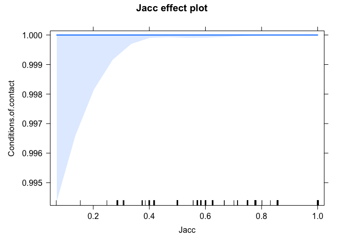
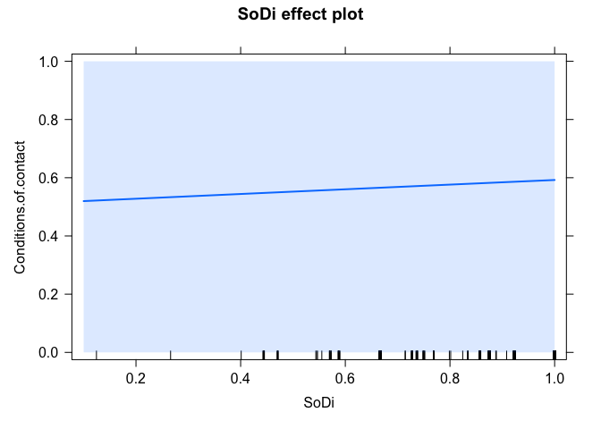
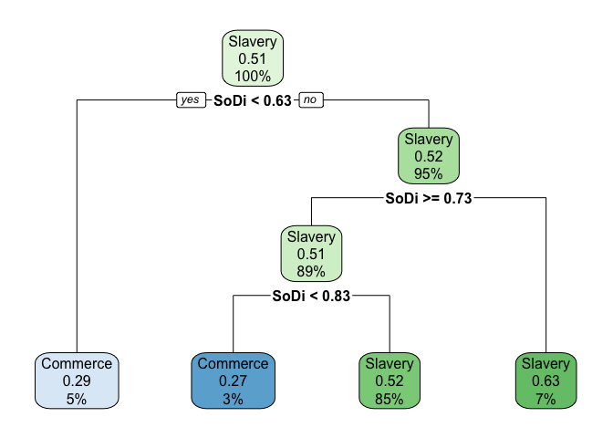

sample\_analysis
================
Nicholas A. Lester
9/21/2021

Some ideas for analysis for Carlos (if he hasn’t done them already).

``` r
rm(list=ls(all=T))
```

Load libraries

``` r
library(dplyr)
```

    ## 
    ## Attaching package: 'dplyr'

    ## The following objects are masked from 'package:stats':
    ## 
    ##     filter, lag

    ## The following objects are masked from 'package:base':
    ## 
    ##     intersect, setdiff, setequal, union

Load data

``` r
# Carlos' table with PHOIBLE
df = read.table("./consonant_stability_ptspcreoles_database - All.tsv", sep="\t", header=T, comment.char="", quote="", encoding="UTF-8")

# PHOIBLE
load("./feature_table.Rdata")
```

Compare sounds in df

``` r
# Jaccard index
jaccard = function(x, y){
    a = sum(x==1 & y==1)
    b = sum(x==0 & y==1)
    c = sum(x==1 & y==0)
    jacc.ind = a/(a + b + c)
    return(jacc.ind)
}

sorenson.dice = function(x, y){
    j = jaccard(x, y)
    s.d = 2*j/(1+j)
    return(s.d)
}

jacc.diffs = vector()
sd.diffs = vector()
for(i in 1:nrow(df)){
    curr.lex.pho = df$Lexifier.s.Phoneme[i]
    curr.lex.vec = pho[pho$Phoneme==curr.lex.pho,][,-38]
    curr.cre.pho = df$Creole.s.Phoneme[i]
    curr.cre.vec = pho[pho$Phoneme==curr.cre.pho,][,-38]
    if(nrow(curr.lex.vec)==1 & nrow(curr.cre.vec)==1){
        curr.jacc.diff = jaccard(curr.lex.vec, curr.cre.vec)
        curr.sd.diff = sorenson.dice(curr.lex.vec, curr.cre.vec)
        jacc.diffs = c(jacc.diffs, curr.jacc.diff)
        sd.diffs = c(sd.diffs, curr.sd.diff)
    }
}

phones = unique(pho$Phoneme)
df = df[df$Creole.s.Phoneme %in% phones &
        df$Lexifier.s.Phoneme %in% phones,]

df = df %>% 
     bind_cols(., Jacc = jacc.diffs, SoDi = sd.diffs)
```

Try some modeling

``` r
library(lmerTest)
```

    ## Loading required package: lme4

    ## Loading required package: Matrix

    ## 
    ## Attaching package: 'lmerTest'

    ## The following object is masked from 'package:lme4':
    ## 
    ##     lmer

    ## The following object is masked from 'package:stats':
    ## 
    ##     step

``` r
library(effects)
```

    ## Loading required package: carData

    ## lattice theme set by effectsTheme()
    ## See ?effectsTheme for details.

``` r
df$Conditions.of.contact = as.factor(df$Conditions.of.contact)

mod.jacc = glmer(Conditions.of.contact ~ Jacc + (1|Language) + (1|Lexifier), data=df, family = "binomial", glmerControl(optimizer = "bobyqa", optCtrl = list(maxfun = 100000)))
```

    ## boundary (singular) fit: see ?isSingular

``` r
summary(mod.jacc)
```

    ## Generalized linear mixed model fit by maximum likelihood (Laplace
    ##   Approximation) [glmerMod]
    ##  Family: binomial  ( logit )
    ## Formula: Conditions.of.contact ~ Jacc + (1 | Language) + (1 | Lexifier)
    ##    Data: df
    ## Control: glmerControl(optimizer = "bobyqa", optCtrl = list(maxfun = 1e+05))
    ## 
    ##      AIC      BIC   logLik deviance df.resid 
    ##     45.2     63.7    -18.6     37.2      756 
    ## 
    ## Scaled residuals: 
    ##        Min         1Q     Median         3Q        Max 
    ## -0.0104671 -0.0099260  0.0004250  0.0004258  0.0004705 
    ## 
    ## Random effects:
    ##  Groups   Name        Variance  Std.Dev. 
    ##  Language (Intercept) 7.397e+03 8.601e+01
    ##  Lexifier (Intercept) 9.506e-10 3.083e-05
    ## Number of obs: 760, groups:  Language, 23; Lexifier, 2
    ## 
    ## Fixed effects:
    ##             Estimate Std. Error z value Pr(>|z|)   
    ## (Intercept)  15.2622     5.5269   2.761  0.00576 **
    ## Jacc          0.2172     5.8186   0.037  0.97023   
    ## ---
    ## Signif. codes:  0 '***' 0.001 '**' 0.01 '*' 0.05 '.' 0.1 ' ' 1
    ## 
    ## Correlation of Fixed Effects:
    ##      (Intr)
    ## Jacc -0.920
    ## optimizer (bobyqa) convergence code: 0 (OK)
    ## boundary (singular) fit: see ?isSingular

``` r
plot(allEffects(mod.jacc), rescale.axis=F)
```

<!-- -->

``` r
mod.dice = glmer(Conditions.of.contact ~ SoDi + (1|Language) + (1|Lexifier), data=df, family = "binomial", nAGQ=0)

anova(mod.jacc)
```

    ## Analysis of Variance Table
    ##      npar     Sum Sq    Mean Sq F value
    ## Jacc    1 6.2349e-05 6.2349e-05   1e-04

``` r
plot(allEffects(mod.dice), rescale.axis=F)
```

<!-- -->

``` r
library(rpart); library(rpart.plot)
class.model = rpart(Conditions.of.contact ~ SoDi, data=df)
rpart.plot(class.model)
```

<!-- -->
