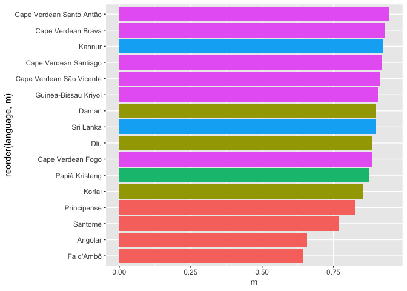

Which creoles are the most stable?
================
Carlos Silva and Steven Moran
(12 June, 2021)

Packages required.

``` r
library(tidyverse)
```

    ## ── Attaching packages ─────────────────────────────────────── tidyverse 1.3.1 ──

    ## ✓ ggplot2 3.3.3     ✓ purrr   0.3.4
    ## ✓ tibble  3.1.2     ✓ dplyr   1.0.6
    ## ✓ tidyr   1.1.3     ✓ stringr 1.4.0
    ## ✓ readr   1.4.0     ✓ forcats 0.5.1

    ## ── Conflicts ────────────────────────────────────────── tidyverse_conflicts() ──
    ## x dplyr::filter() masks stats::filter()
    ## x dplyr::lag()    masks stats::lag()

Load the data.

``` r
database <- read_csv('database.csv')
```

    ## 
    ## ── Column specification ────────────────────────────────────────────────────────
    ## cols(
    ##   language = col_character(),
    ##   class = col_character(),
    ##   position = col_character(),
    ##   lexifier_phoneme = col_character(),
    ##   creole_phoneme = col_character(),
    ##   place_stability = col_double(),
    ##   manner_stability = col_double(),
    ##   example = col_character(),
    ##   reference = col_character(),
    ##   gloss = col_character()
    ## )

Preparing the data.

``` r
creole_stability <- database %>% select(language, place_stability, manner_stability)

creole_stability$place_stability = as.numeric(creole_stability$place_stability)

creole_stability$manner_stability = as.numeric(creole_stability$manner_stability)
```

Calculate the stability for each creole.

``` r
global_creole_stability <- mutate(creole_stability, global_stability = (place_stability + manner_stability)/2)

final_results <- global_creole_stability %>% group_by(language) %>% summarize(m = mean(global_stability, na.rm = TRUE))
```

Plot the results.

``` r
region <- c("GG", "UG", "UG", "UG", "UG", "UG", "NI", "NI", "GG", "UG", "SI", "NI", "SA", "GG", "GG", "SI")

final_results_region <- cbind(final_results, region)

ggplot(final_results_region) + geom_bar(aes(x = m, y = reorder(language, m), fill = region), stat = "identity", show.legend = FALSE)
```

<!-- -->

Which segments are the most stable?
