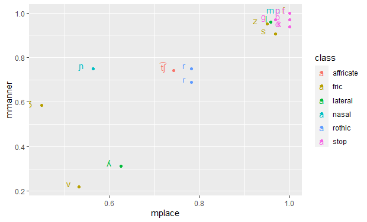
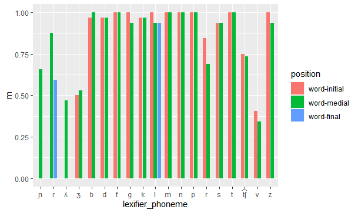
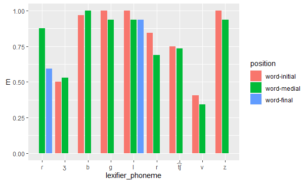

Which creoles are the most stable?
================
Carlos Silva and Steven Moran
(12 June, 2021)

Packages required.

``` r
library(tidyverse)
```

    ## ── Attaching packages ─────────────────────────────────────── tidyverse 1.3.1 ──

    ## ✓ ggplot2 3.3.3     ✓ purrr   0.3.4
    ## ✓ tibble  3.1.2     ✓ dplyr   1.0.6
    ## ✓ tidyr   1.1.3     ✓ stringr 1.4.0
    ## ✓ readr   1.4.0     ✓ forcats 0.5.1

    ## ── Conflicts ────────────────────────────────────────── tidyverse_conflicts() ──
    ## x dplyr::filter() masks stats::filter()
    ## x dplyr::lag()    masks stats::lag()

Load the data.

``` r
database <- read_csv('database.csv')
```

    ## 
    ## ── Column specification ────────────────────────────────────────────────────────
    ## cols(
    ##   language = col_character(),
    ##   class = col_character(),
    ##   position = col_character(),
    ##   lexifier_phoneme = col_character(),
    ##   creole_phoneme = col_character(),
    ##   place_stability = col_double(),
    ##   manner_stability = col_double(),
    ##   example = col_character(),
    ##   reference = col_character(),
    ##   gloss = col_character()
    ## )

Preparing the data.

``` r
creole_stability <- database %>% select(language, place_stability, manner_stability)

creole_stability$place_stability = as.numeric(creole_stability$place_stability)

creole_stability$manner_stability = as.numeric(creole_stability$manner_stability)
```

Calculate the stability for each creole.

``` r
global_creole_stability <- mutate(creole_stability, global_stability = (place_stability + manner_stability)/2)

final_results <- global_creole_stability %>% group_by(language) %>% summarize(m = mean(global_stability, na.rm = TRUE))
```

Plot the results.

``` r
region <- c("GG", "UG", "UG", "UG", "UG", "UG", "NI", "NI", "GG", "UG", "SI", "NI", "SA", "GG", "GG", "SI")

final_results_region <- cbind(final_results, region)

ggplot(final_results_region) + geom_bar(aes(x = m, y = reorder(language, m), fill = region), stat = "identity", show.legend = FALSE)
```

<!-- -->

Which segments are the most stable?
================

Packages required.
```r
library(tidyverse)
```

Load data.

```r
database <- read_csv('database.csv')
```

Prepare data.
```r
data_by_phoneme <- database %>% select(lexifier_phoneme, place_stability, manner_stability)

data_by_phoneme$place_stability = as.numeric(data_by_phoneme$place_stability)

data_by_phoneme$manner_stability = as.numeric(data_by_phoneme$manner_stability)
```

Calculate stability of place and manner for each phoneme.

```r
place_results <- data_by_phoneme %>% group_by(lexifier_phoneme) %>% summarize(mplace = mean(place_stability, na.rm = TRUE))

manner_results <- data_by_phoneme %>% group_by(lexifier_phoneme) %>% summarize(mmanner = mean(manner_stability, na.rm = TRUE))

consonant_stability <- left_join(place_results, manner_results, by = "lexifier_phoneme")

class <- c("nasal", "rothic", "lateral", "fric", "stop", "stop", "fric", "stop", "stop", "lateral", "nasal", "nasal", "stop", "rothic", "fric", "stop", "affricate", "fric", "fric")

consonant_stability_class <- cbind(consonant_stability, class)
```

Plot the results

```r
ggplot(consonant_stability, aes(y=mmanner, x=mplace, label = lexifier_phoneme, color=class)) + 
  geom_point(position= "dodge") + geom_text(aes(label=lexifier_phoneme), hjust=3, vjust=0)
```
<!-- -->

Alternative view for listed global results

```r
consonant_global_stability <- mutate(consonant_stability_class, mglobal = (mmanner + mplace)/2)

ggplot(consonant_global_stability) + geom_bar(aes(x = mglobal, y = reorder(lexifier_phoneme, mglobal), fill = class), stat = "identity", show.legend = TRUE)
```
<!-- -->

Does word position influence stability?
====

Packages required.

```r
library(tidyverse)
```

Load data.

```r
database <- read_csv('database.csv')
```

Prepare data.

```r
data_by_position <- database %>% select(position, lexifier_phoneme, place_stability, manner_stability) %>% mutate(position = tolower(position))

data_by_position$place_stability = as.numeric(data_by_position$place_stability)

data_by_position$manner_stability = as.numeric(data_by_position$manner_stability)
```

Calculate stability for each segment according to its position.

```r
position_stability <- mutate(data_by_position, global_stability = (place_stability + manner_stability)/2)

position_results <- position_stability %>% group_by(position, lexifier_phoneme) %>% summarize(m = mean(global_stability, na.rm = TRUE))
```

Plot the results for all segments.

```r
position_results$position <- factor(position_results$position, levels = c('word-initial', 'word-medial', 'word-final'))

ggplot(position_results, aes(x= lexifier_phoneme, y=m, fill=position)) + 
  geom_col(position = position_dodge2(width= 0.9, preserve = "single"))
```
<!-- -->

Plot the results for segments that show differences

```r
position_results1 <- position_results %>% pivot_wider(names_from = position, values_from = m)

different_position <- subset(position_results1, position_results1$`word-initial` != position_results1$`word-medial` | position_results1$`word-final` != position_results1$`word-medial`)

different_position_results <- different_position %>% pivot_longer(c(`word-initial`, `word-medial`, `word-final`), names_to = "position", values_to = "m")

different_position_results$position <- factor(different_position_results$position, levels = c('word-initial', 'word-medial', 'word-final'))

ggplot(different_position_results, aes(x= lexifier_phoneme, y=m, fill=position)) + 
  geom_col(position = position_dodge2(width= 0.9, preserve = "single"))
```
<!-- -->
